# 碰撞检测之碰撞检测函数

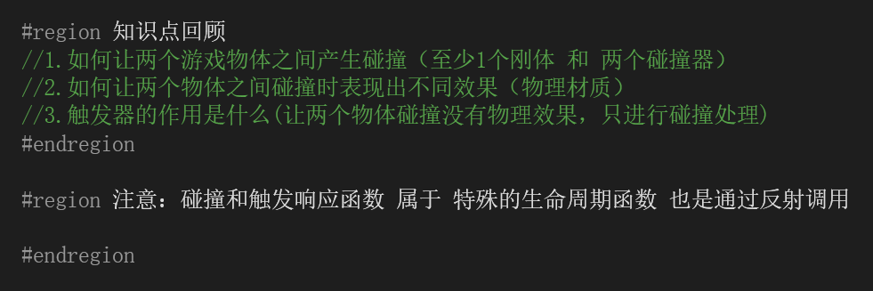

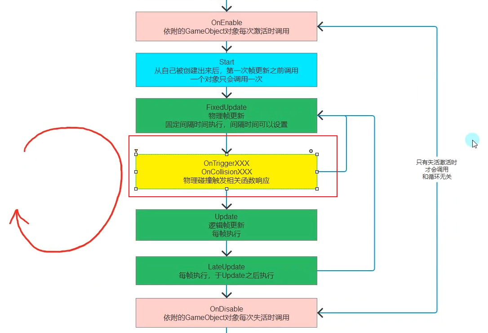

每次物理更新都会检查物理碰撞触发相关函数相应

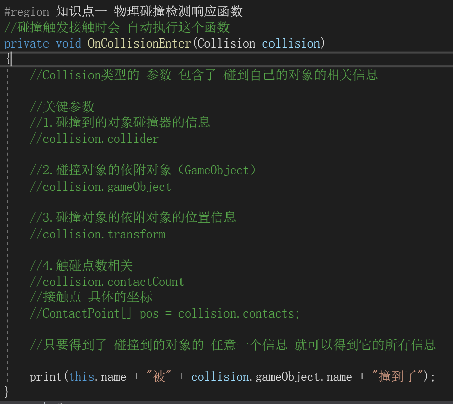

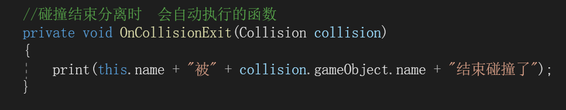

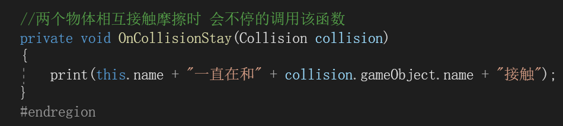

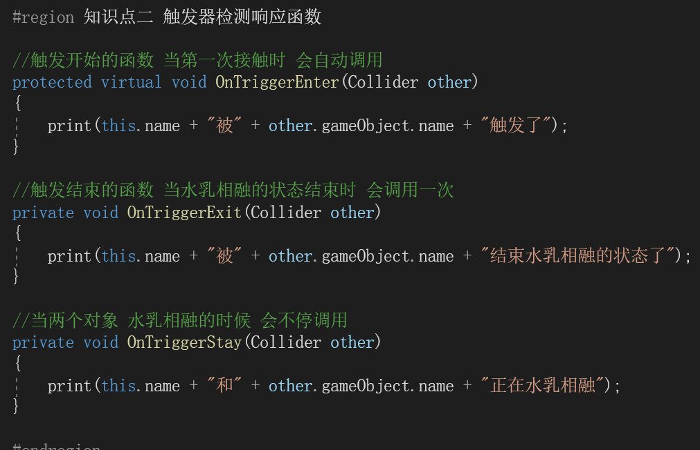

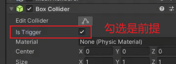

打开就变成了触发器，不打开就是碰撞器

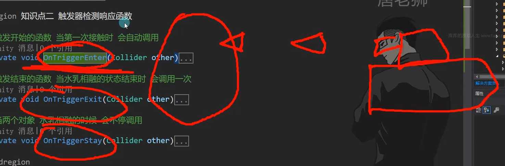

当子弹进入的时候只有在刚开始的时候才有扣血，所以各种函数可以选择性使用

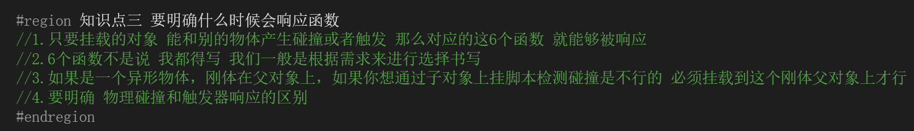

被挂载的物体只要发生了碰撞或触发都会被相应，无论这个物体是否有刚体

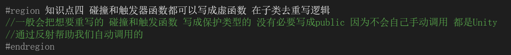

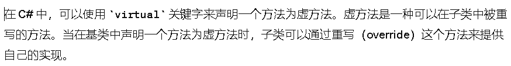

eg:

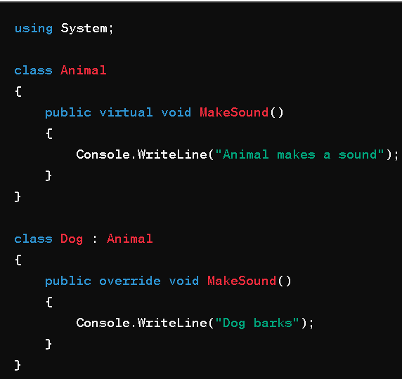

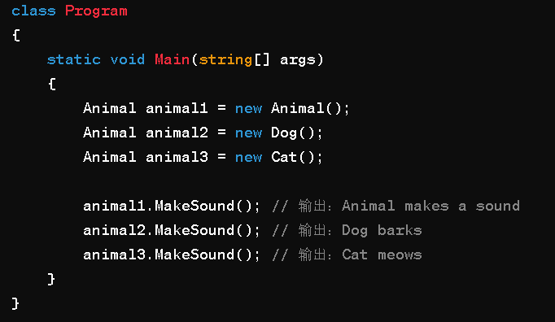

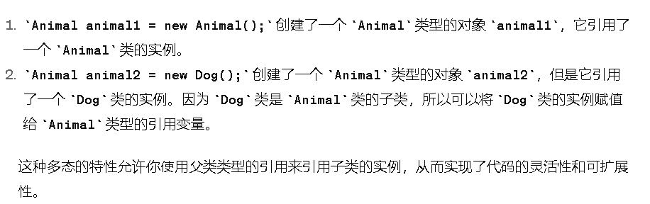

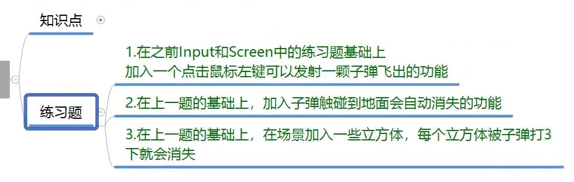

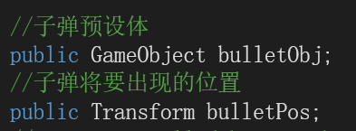

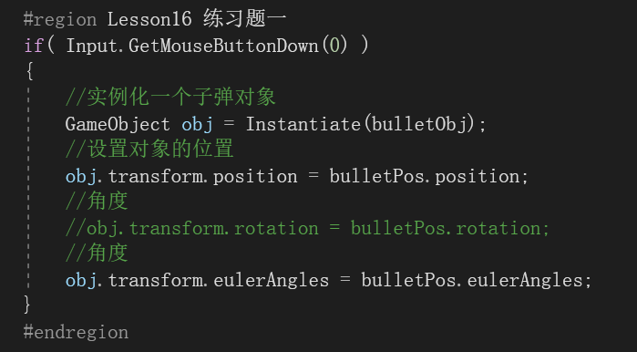

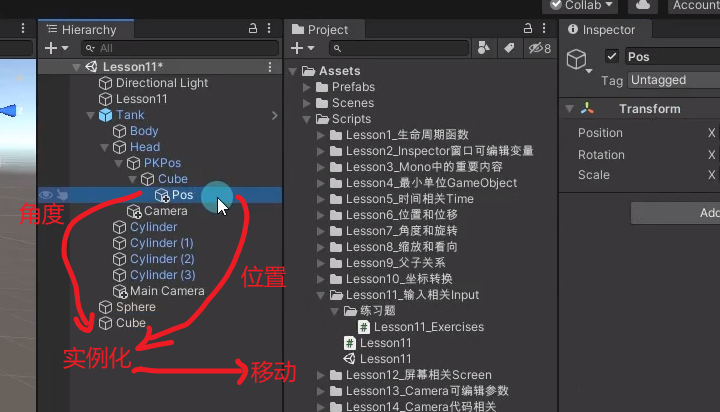

创建另一个子弹脚本

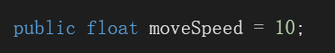

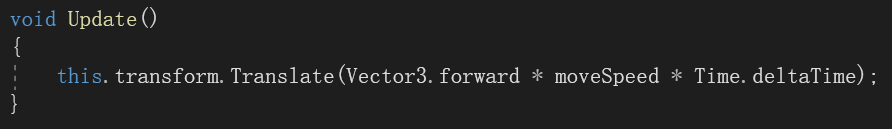

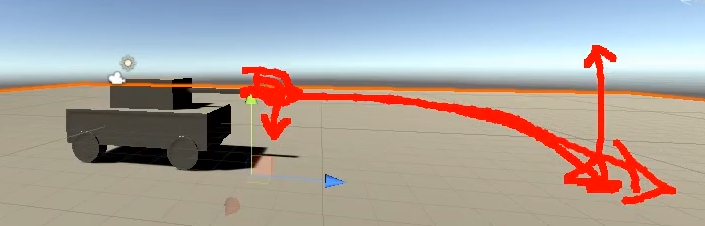

问题二：

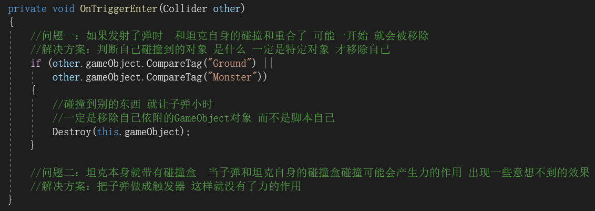

问题三

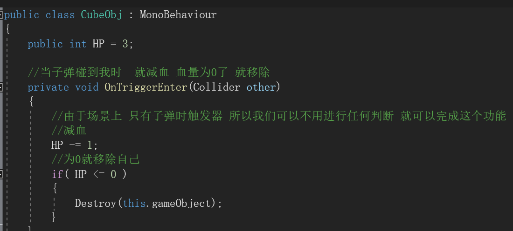
