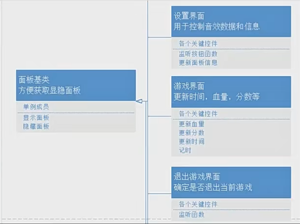
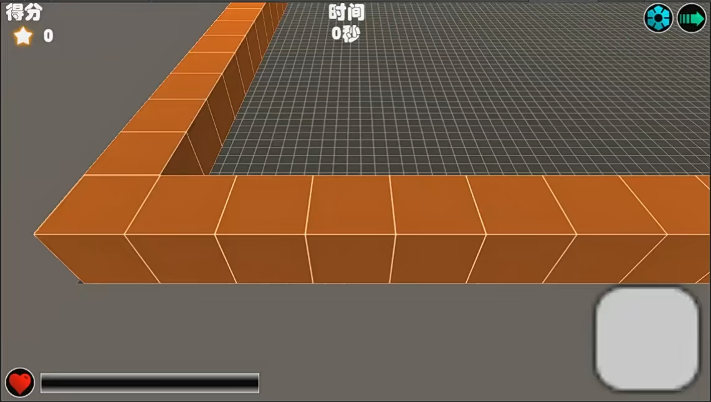

# 实践小项目游戏主界面





0.拼界面

1.写脚本

2.血量=百分比=当前血量/最大血量*宽

3.

```
在update用帧更新来更新时间
public void Update()
    {
        nowtime +=Time.deltaTime;
        time = (int)nowtime;
        labTime.content.text = "";
        if (time/3600>0)//秒换成时分秒
        {
            labTime.content.text += time / 3600 + "时";
        }
        if (time%3600/60>0||labTime.content.text!="")
        {
            labTime.content.text += time % 3600 / 60 + "分";
        }
        else
            labTime.content.text += time % 60 + "秒";
    }
```
