# 实践小项目武器和子弹对象

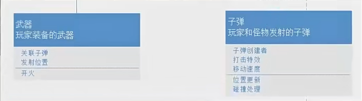

子弹发射的逻辑：

玩家开火——>武器创建出一个子弹

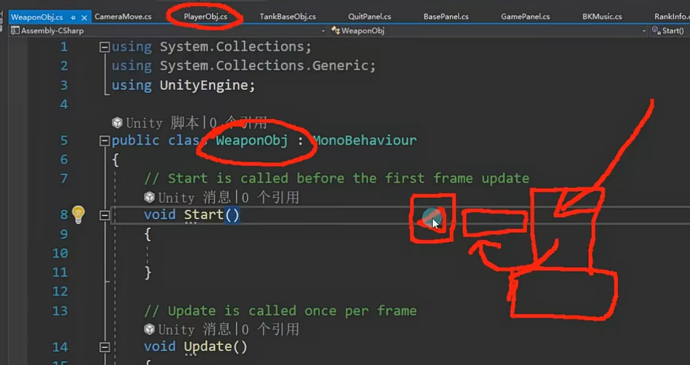

子弹发射——炮管——炮管创建一个子弹发射出去

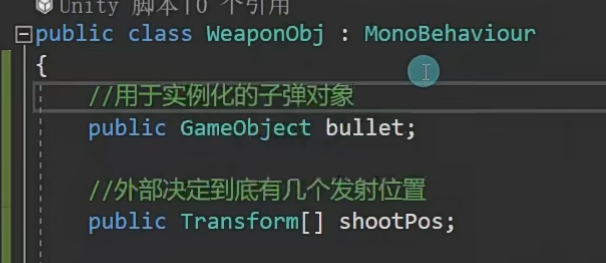

因为有的武器有几个炮管，所以子弹位置信息用数组存起来

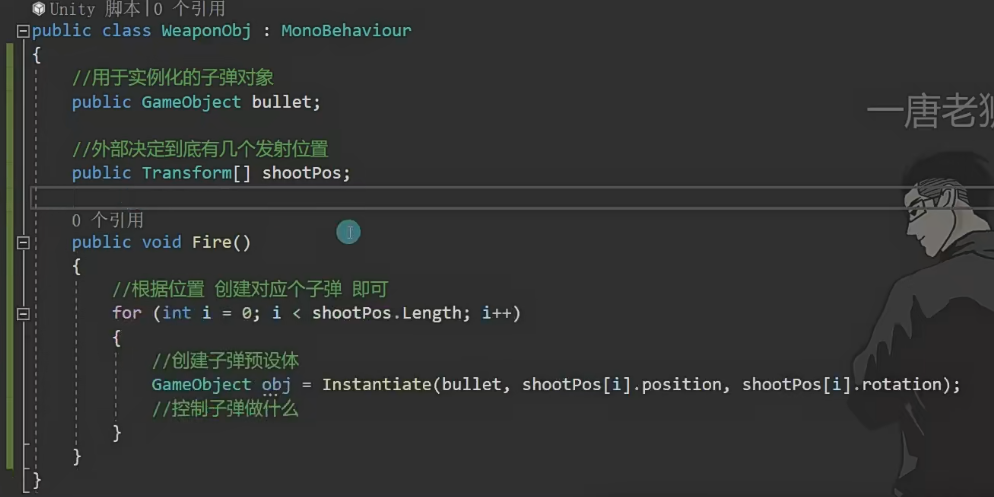

子弹：

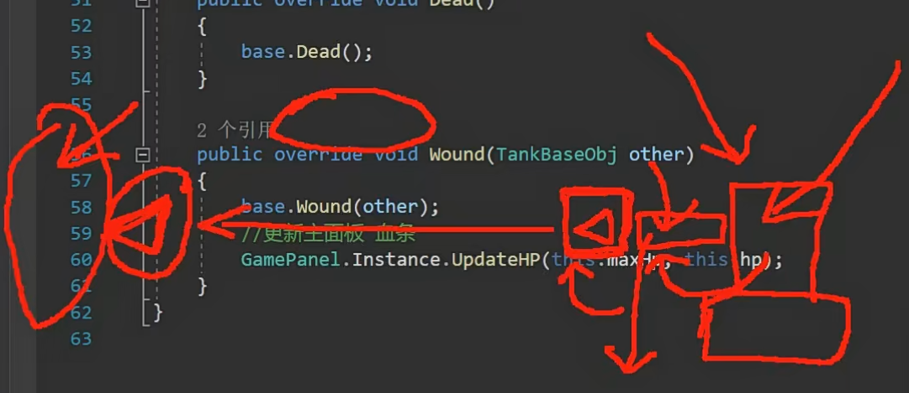

子弹：

让人受伤——>要知道发射者是谁，因为受伤的逻辑是将造成伤害的对象传进来，所以武器要知道拥有者是谁，子弹才能知道谁发射的，物体才能知道谁给自己造成了伤害

发射出去

---

---

创建子弹脚本，移动，移动子弹的脚本给到子弹预设体

不希望改变资源里的预设体，所以拖出来挂上子弹脚本重新设成预设体

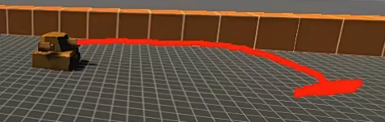

加刚体和碰撞盒（做成触发器，检测是否碰到敌人）

触发监听函数，和别人碰撞触发的效果，用tag来区分

---

如何知道是谁发射的？

子弹在创建的时候就得到拥有者，被击中的物体得到发射者对象是谁

（得到父类对象，创建了子弹后，得到子弹脚本并存起来，用子弹脚本调用存入函数将自己的父对象传过去）

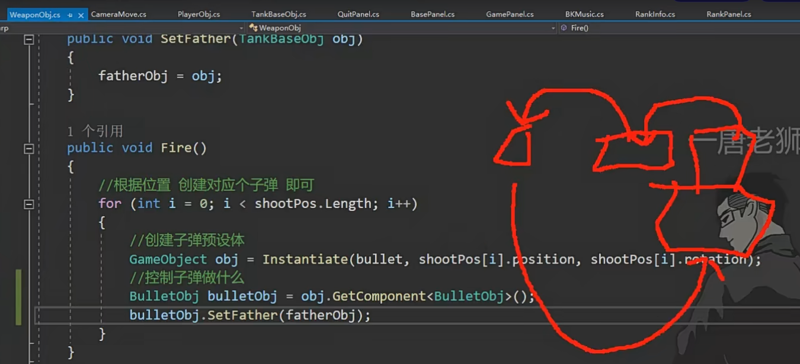

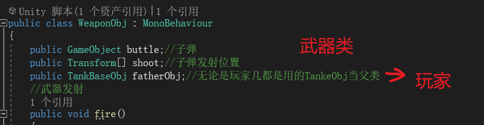

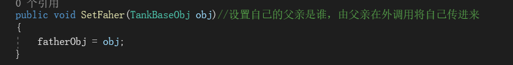

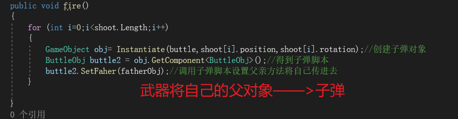

---

给坦克预设体加上刚体约束，碰撞的时候就不会乱转和乱走了，只要x,z才受影响

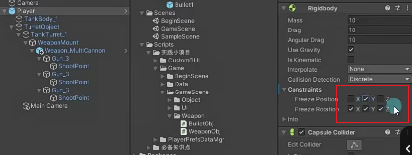

子弹碰撞销毁时可以创建一个爆炸特效，还有记得将音效与设置面板音效关联
