# Hierarchy层级窗口，Scene场景窗口

 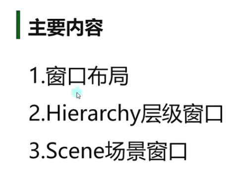

1.窗口快速布局

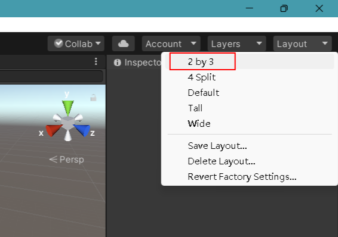

推荐2by3的布局

学习Hierarchy就是学习对象的操作和创建

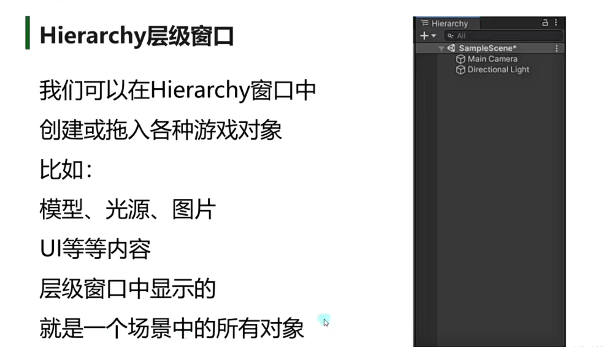

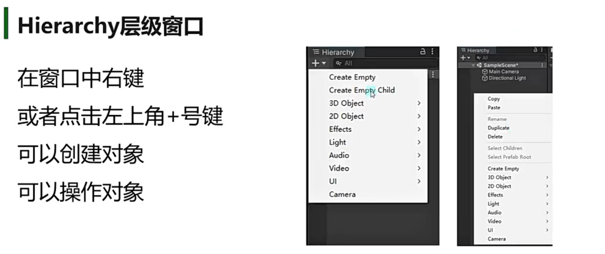

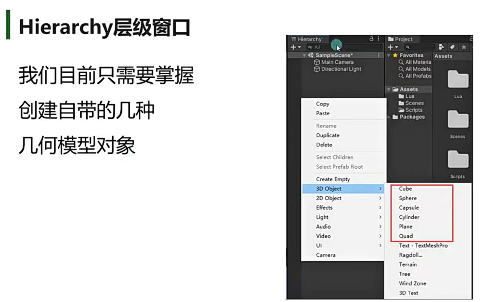

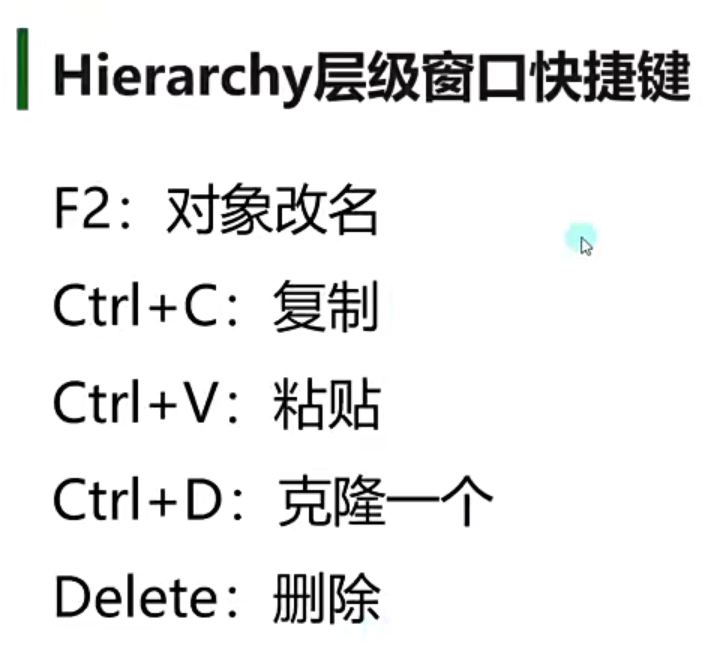

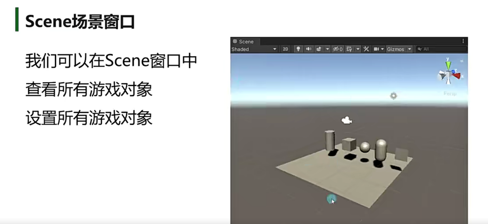

2D只有做2D游戏或者UI的时候才会用，3D游戏不会用

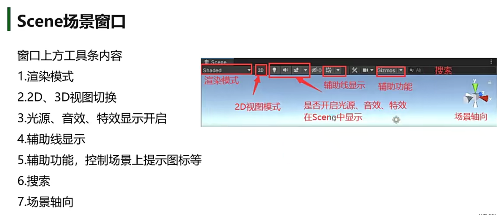

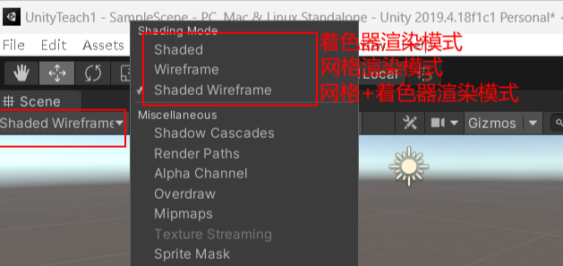

    

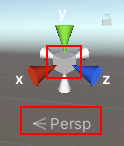

点击切换正交模式（所有物体一般大，适合做 2D游戏），透视模式（符合人眼需求的观测模式，近大远小，一般做3D游戏）

点击x,y,z轴就是从不同的方位去观测，白色就是与之相反的反向观测

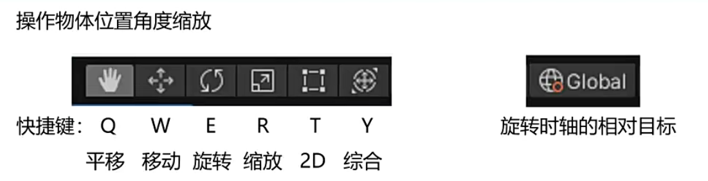

Global:切换全局的xyz视角或者物体本身的xyz视角

center是游戏物体中心位置的坐标原点，相当于游戏物体的形状中心，是 Unity 根据游戏物体的形状自动确定的坐标点

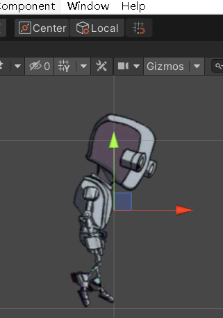

游戏物体自身的坐标原点，是美术设计师在建模时设置的模型原点。pivot

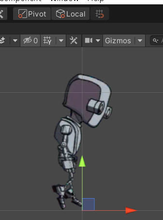

磁铁可以一格一格动，+ctrl可以快捷切换平滑

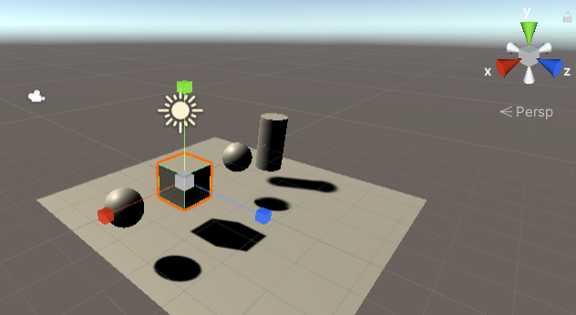

按中间等比缩放，红绿蓝xyz方向缩放

2D：只在做2D游戏或者UI时才做

Y：旋转，移动加缩放都有

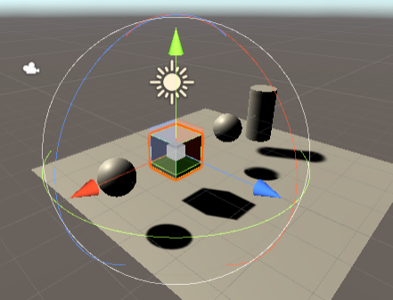

碰撞盒：学习物理相关才需要

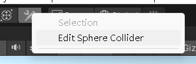

重要！！

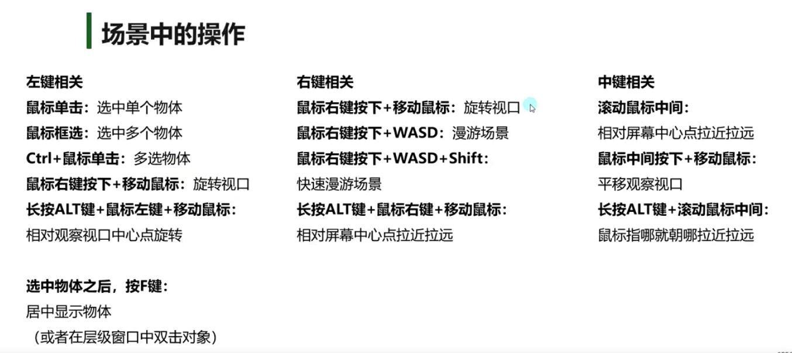

1.隐藏物体

2.锁定物体

3.显示有几个物体被隐藏

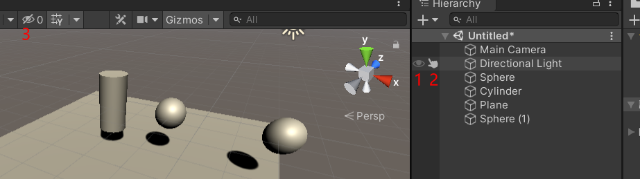

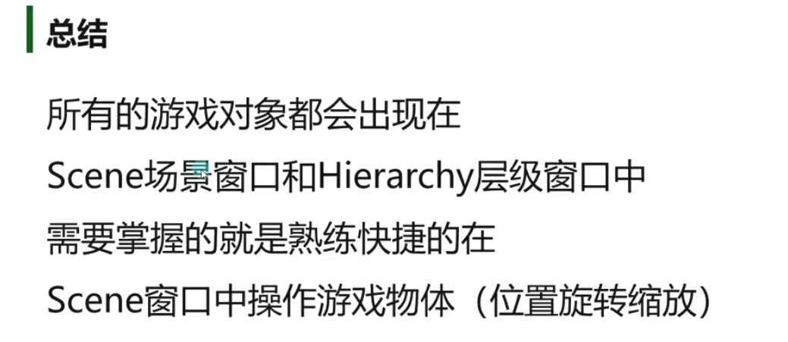
