# 反射机制和游戏场景

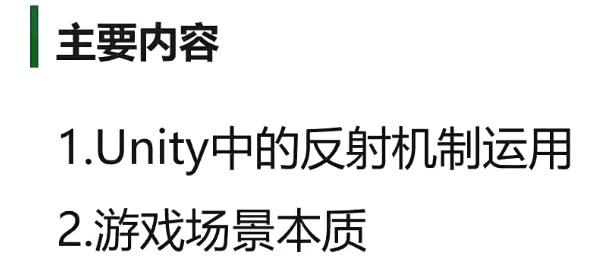

1.

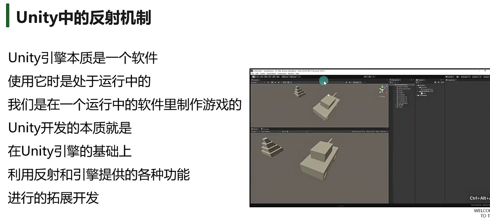

 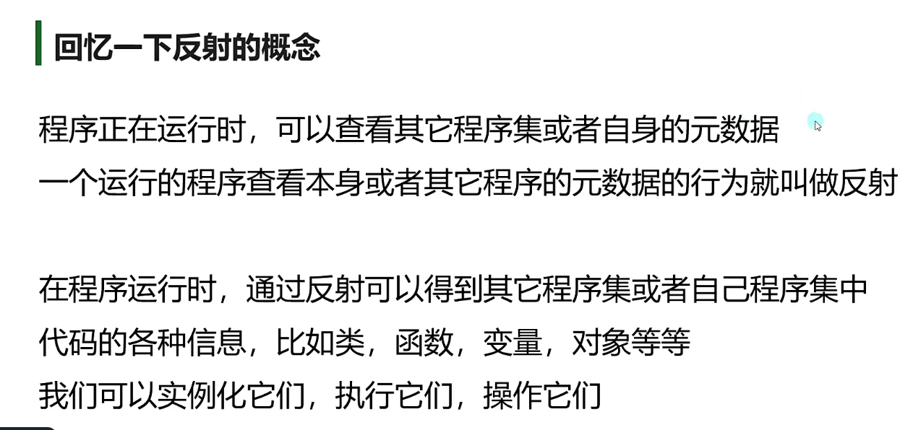

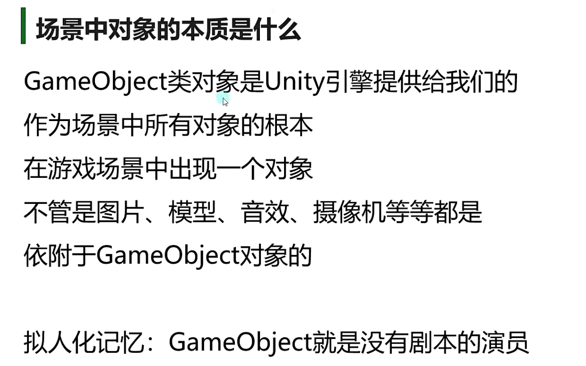

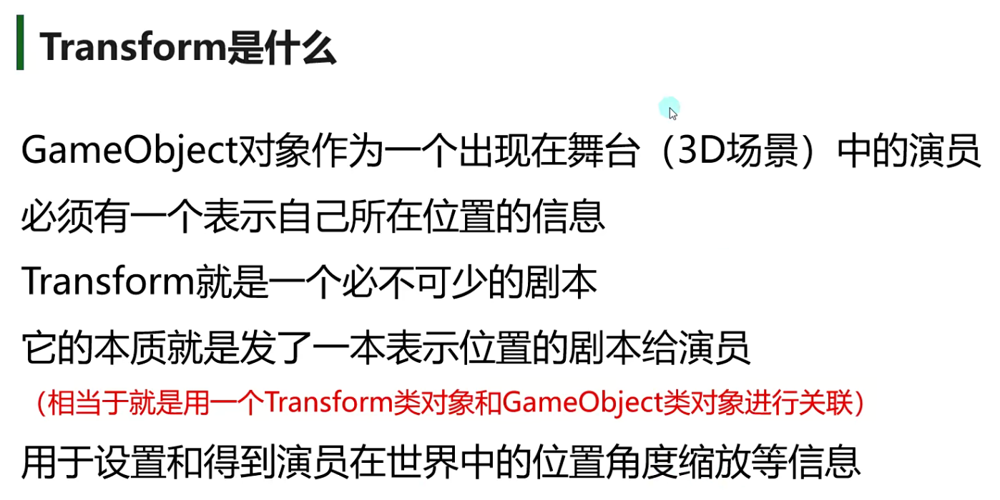

不同类之间对象间的调用

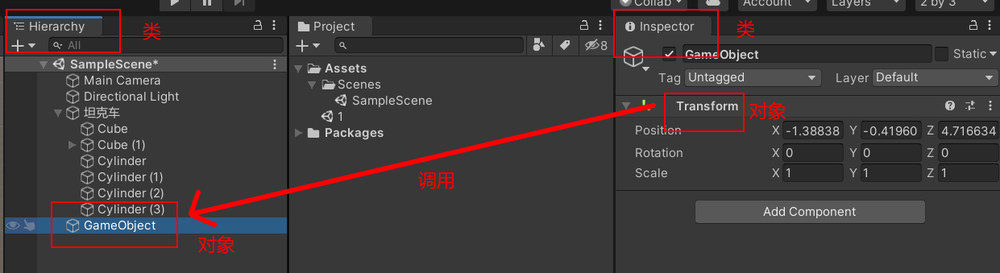

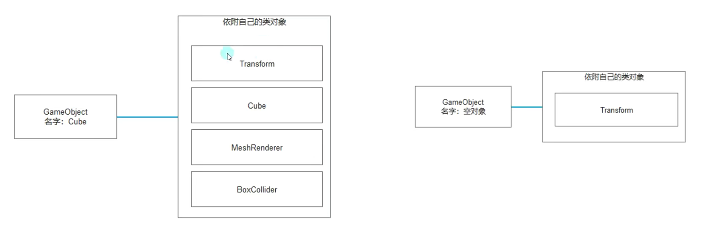

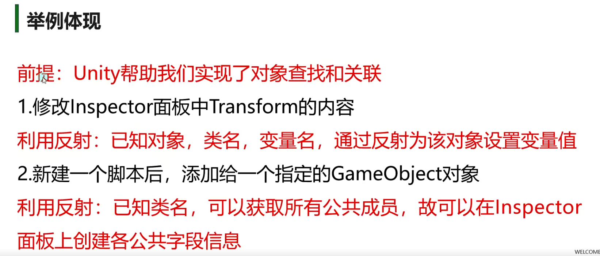

可以在project创建一个c#文件拖拽到物体上实现关联，利用反射获取c#里面的属性

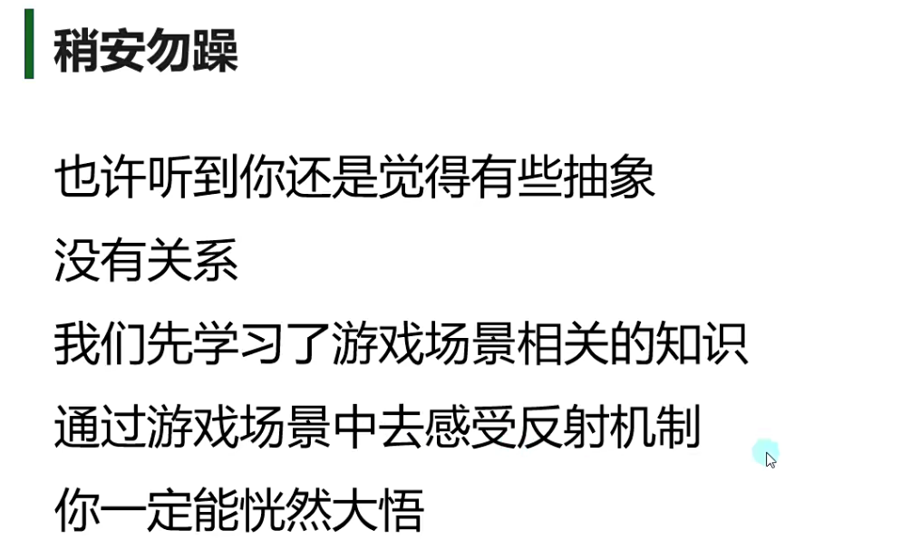

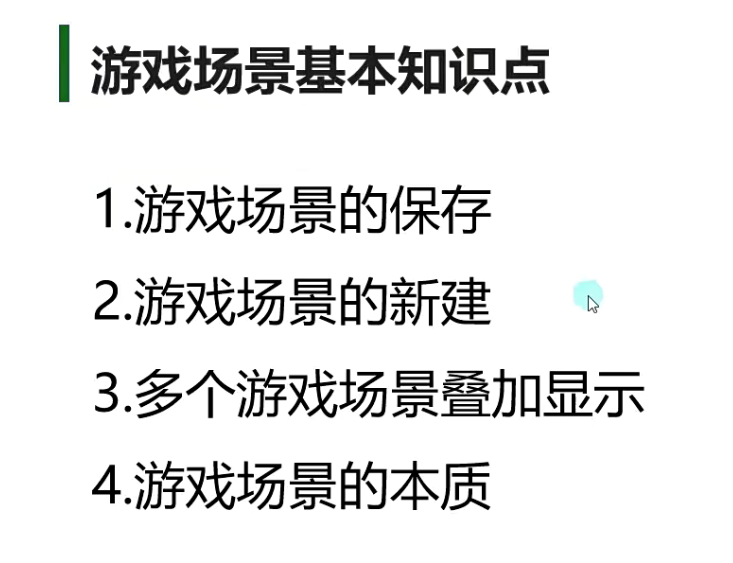

3.通过两个场景的叠加显示，拷贝另一个场景的物体

4.场景的本质就是配置文件

通过反射读出来数据和创建数据--unity机制

通过字符串创建类对象，通过反射用成员变量赋值类对象的变量==有点像java的类之间的传参

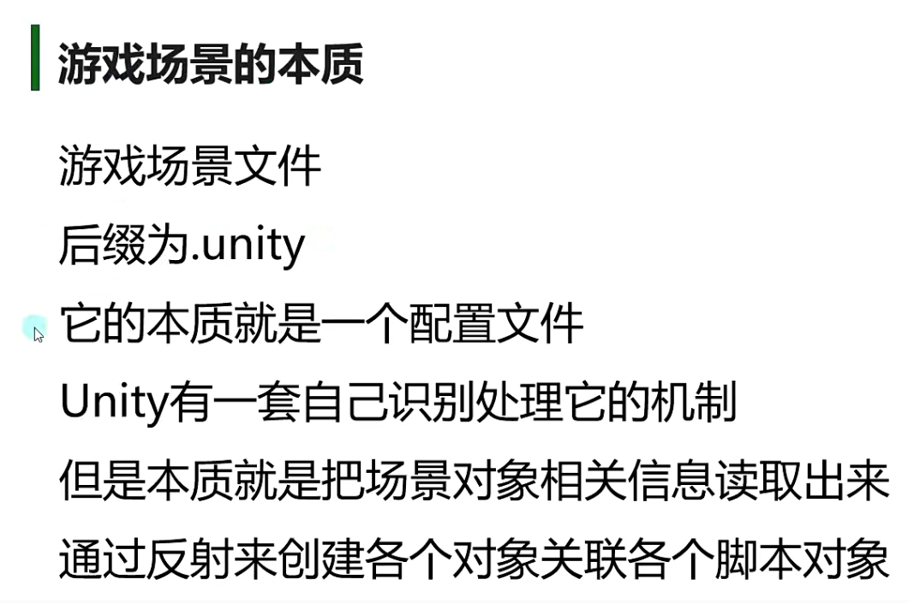

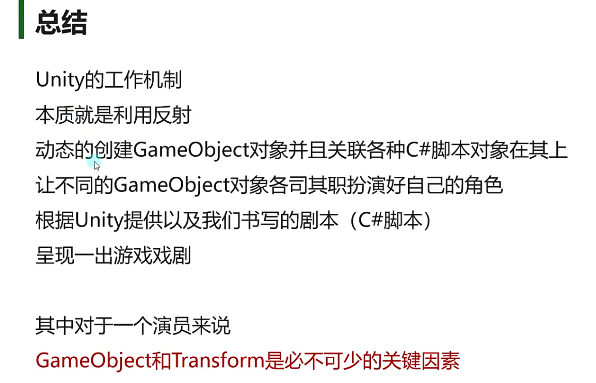
