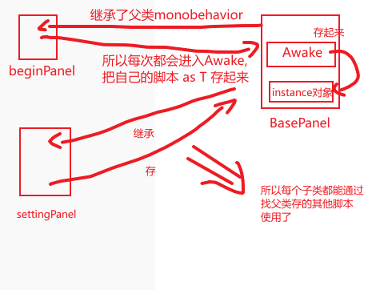
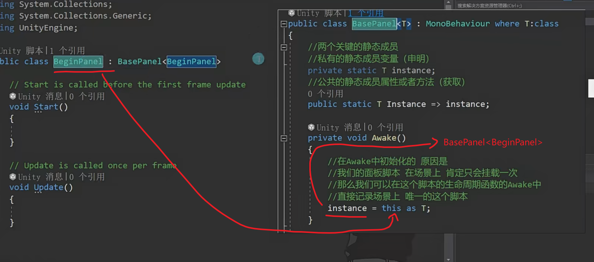
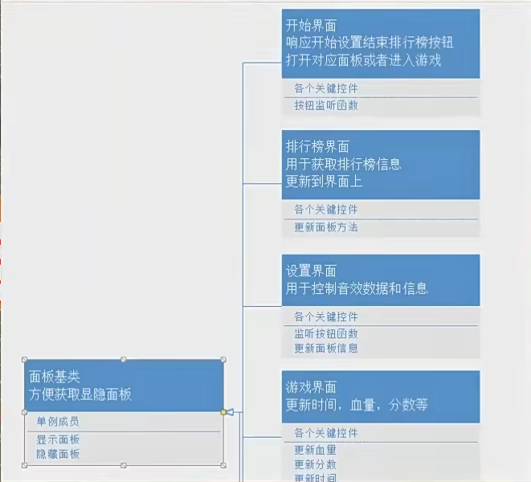
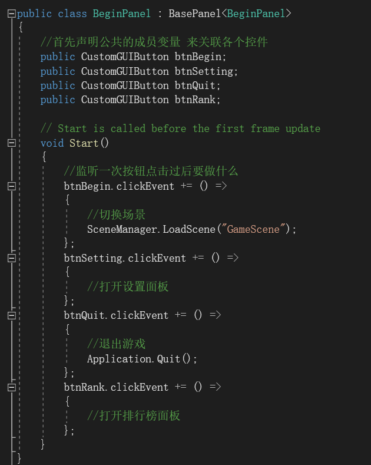
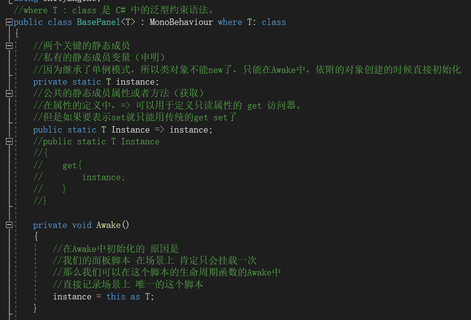
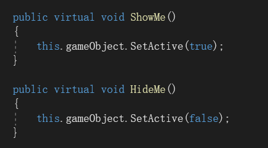

# 实践小项目开始界面

1.拼界面

2.写代码：

{

1.基类面板，把所有面板公共的行为和变量写在一个基类中

2.开始面板逻辑：监听按钮，实现按钮按下的行为

}

T的类型是BasePanel<T>，然后传进来的this是beginPanel，然后T就变成了BasePanel<beginPanel>类型，所以必须把传进来的beginPanel变成BasePanel<beginPanel>存起来

1.单例对象：两个静态（静态对象+静态属性）

2.两个虚方法：显示面板，隐藏面板

---

---

总结：

1.beginPnael继承了BasePanel,所以继承了BasePanel的Monobehavior，所以可以挂载到对象上，因为BasePanel是单例对象，所以只能有一个beginPnael类继承

2.beginPnael类声明两个脚本对象，然后就可以调用各自脚本的响应事件了

3.各个界面通过BasePanel单例对象实现唯一性界面，各个面板再实现自己的操作
