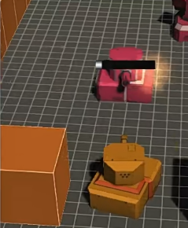
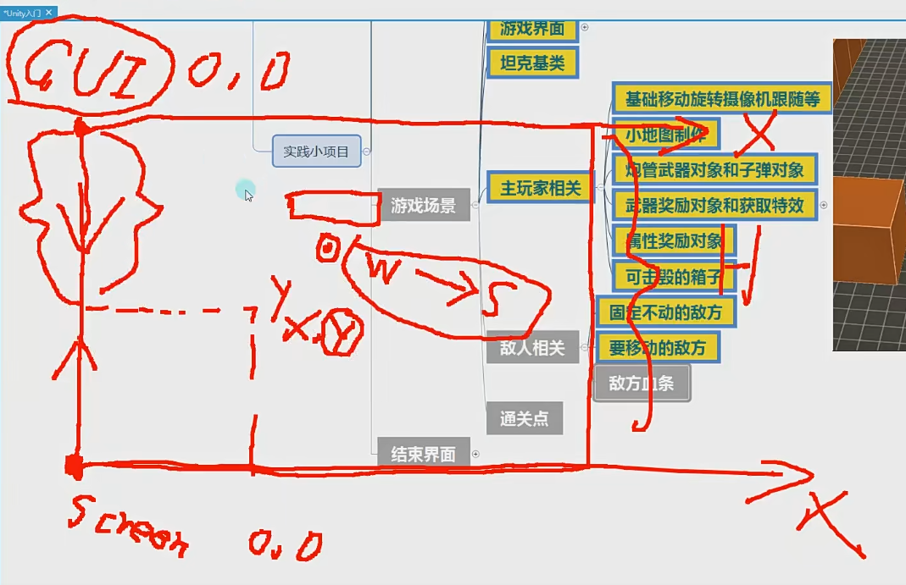
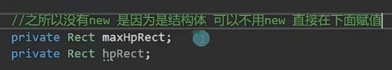
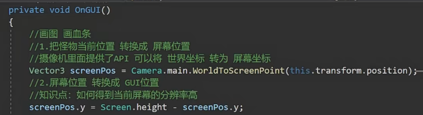
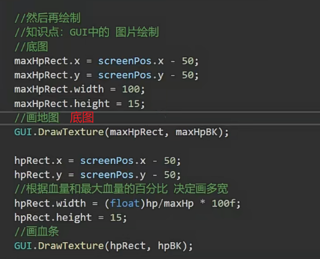
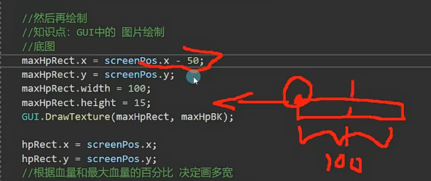
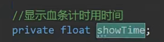
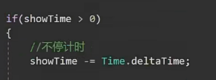
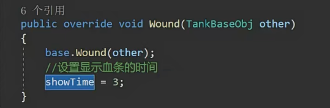

# 实践小项目怪物血条

GUI和屏幕的原点和方向都不一样

要让血条一直再怪物头上，首先要把怪物的坐标转换为本地坐标

然后再把本地坐标转换成GUI坐标，只需改变y值，用H-y=y

x-50相当于把图标往左边移了一半的位置

怎么做到只有玩家打的时候血条才显示？平常过几秒隐藏

受伤后只有3秒后才会显示绘制内容

只有受伤了，才会把显示时间变成3

连续打就会把时间一直设置成3秒，实现一直显示

如何做到血条近大远小？

用屏幕坐标的z（z得到的是离玩家的距离）

通过z设置gui宽高的缩放
