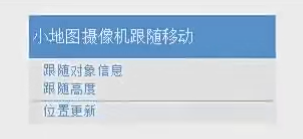
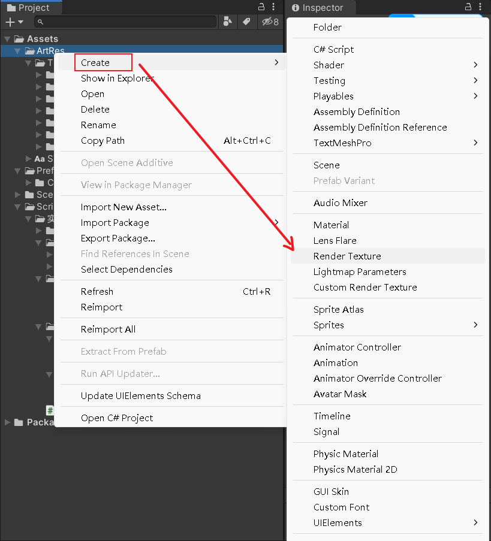
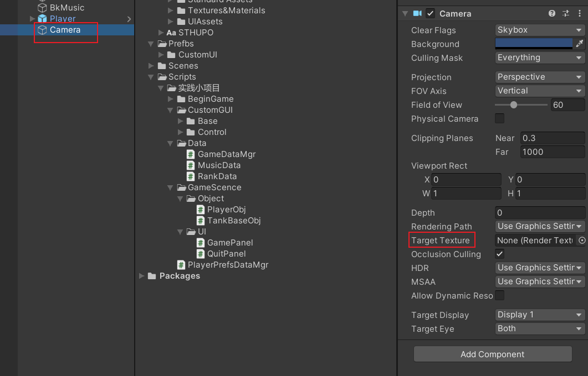
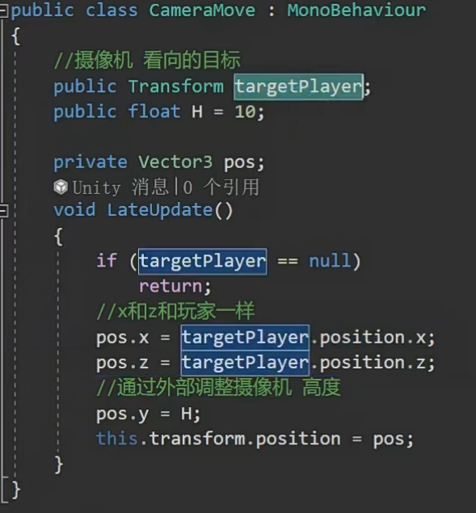

# 实践小项目玩家小地图

1.新建一个摄像机

2.新建一个图

3.将图拖给摄像机上面的目标贴图

4.替换面板的小地图图片就可以了，摄像机内容会实时显示在图片上

5.如何做到小地图只跟着我走动，但是我旋转小地图不跟随

拖到坦克子对象？不行，坦克旋转，小地图也会旋转

写一个脚本控制小地图摄像机更新？

可行

1.摄像机移动最好在lateupdate里写，因为lateupdate和update之间会做一些处理，为了避免渲染或者摄像机看到的东西出现错误，统一写在lateupdate里

