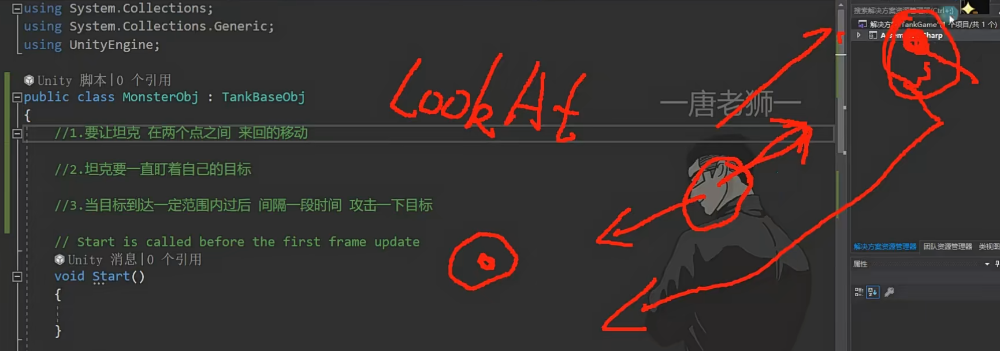
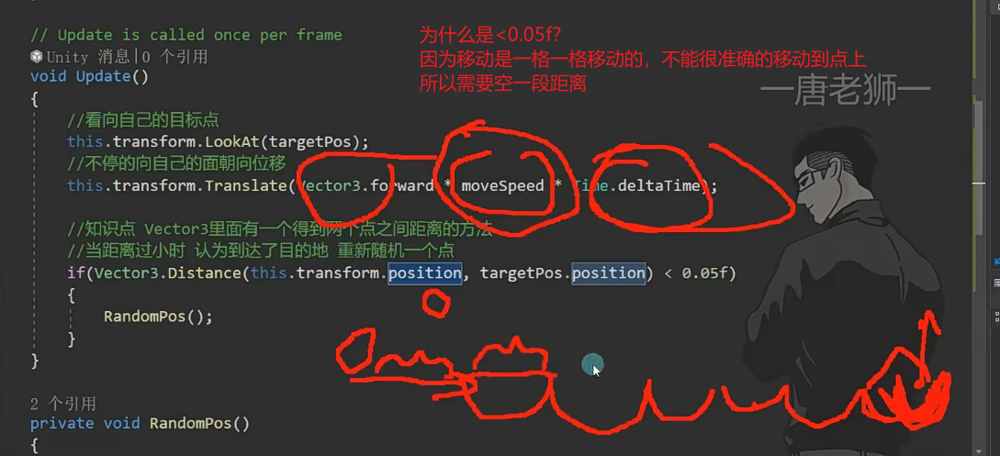
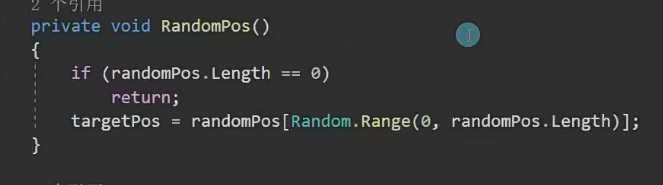

# 实践小项目移动的敌人








```
using System.Collections;
using System.Collections.Generic;
using UnityEngine;
public class MoveMonster : TankBaseObj
{
    //随机移动点
    public Transform[] randomPos;
    //目标点
    public Transform target;
    //炮塔始终朝向位置
    public Transform Player;
    public Transform tower;//炮塔
    public Transform buttlePos;//子弹发射位置
    public GameObject buttle;//关联子弹
    public float time=1;//间隔时间
    public float nowtime = 0;//现在的时间
    public float fireDis = 20;//攻击范围
    private void Update()
    {
        //朝向目标点
        transform.LookAt(target);
        //移动
        transform.Translate(Vector3.forward * Time.deltaTime * moveSpeed);
        tower.LookAt(Player);
        if (Vector3.Distance(this.transform.position, target.position) < 0.05f)//判断与目的地的距离
        {
            //重新随机目标点
            RandomPos();
        }
        if (Vector3.Distance(this.transform.position,Player.position)<=fireDis)
        {
            nowtime += Time.deltaTime;
             if (nowtime >= time)
             {
              nowtime = 0;
              Fire();
             }
        }
        
    }
    public void RandomPos()
    {
        target = randomPos[Random.Range(0,randomPos.Length)];
    }
    public override void Fire()
    {
      GameObject obj=  Instantiate(buttle,buttlePos.transform.position,buttlePos.transform.rotation);
      ButtleObj buttleObj=  obj.GetComponent<ButtleObj>();
      buttleObj.SetFaher(this);
    }
}
```
