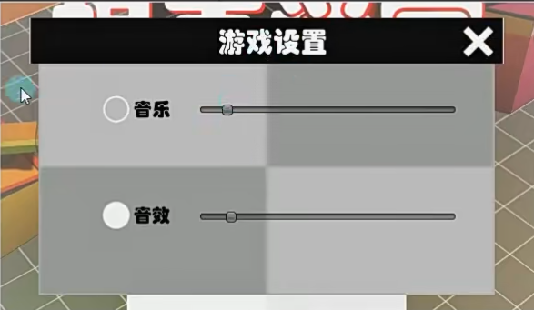

# 实践小项目设置界面

1.拼面板



2.写脚本

{

1.声明设置面板上挂载的所有脚本对象，用来响应事件

2.响应完事件自动隐藏，因为如果一开始失活上面的脚本就获取不了了

Awake，在start之前运行，都获取了再隐藏

3.打开设置显示设置界面，隐藏开始界面

}

设置界面：

```
public class SettingPanel : BasePanel<SettingPanel>
{
    public CustomGUIButton btnClose;
    public CustomGUISlider sldMusic;
    public CustomGUISlider sldSound;
    public CustomGUIToggle togMusic;
    public CustomGUIToggle togSound;
    private datamusic datamusic;
    private void Start()
    {
        
        //dataMgr的DaMgr属性调用里面的changeMusic方法
        sldMusic.Slider_Event += (value) => dataMgr.DaMgr.changeMusic(value);
        sldSound.Slider_Event += (value) => dataMgr.DaMgr.changeSound(value);
        togMusic.Toggle += (value) => dataMgr.DaMgr.openOrCloseMusic(value);
        togSound.Toggle += (value) => dataMgr.DaMgr.openOrCloseSound(value);
        btnClose.clik_Event += () =>
        {
            HideMe();
            BeginPanel.Instance.ShowMe();
        };
        HideMe();
    }
    public void updateScence()
    {
        datamusic datamusic = dataMgr.DaMgr.datamusic;
        sldMusic.Rvalue = datamusic.musicValue;
        sldSound.Rvalue = datamusic.soundValue;
        togMusic.istoggle = datamusic.isMusic;
        togSound.istoggle = datamusic.isSound;
    }
    public override void ShowMe()
    {
        base.ShowMe();
        updateScence();
    }
}

```
