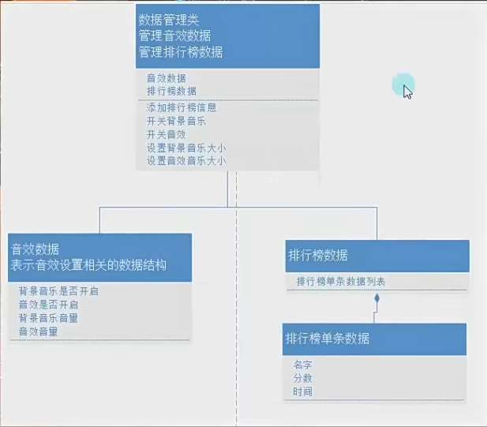

# 实践小项目音效数据逻辑



因为数据管理类只是为了实现设置界面通过它将数据存到音乐数据类里，所以不需要音乐数据类得到其他子类脚本，所以不用设置泛型

1.音乐数据类

2.数据管理单例模式类

3.构造函数初始化第一次取数据

4.设置界面四个方法，将监听的值传到存储的地方

5.数据管理类四个方法，存音乐音效（开关）和调音乐音效（大小）

6.设置界面在展示时更新面板上的值

数据管理类：

```
using System.Collections;
using System.Collections.Generic;
using UnityEngine;
public class dataMgr
{
    private static dataMgr daMgr=new dataMgr();
    public static dataMgr DaMgr => daMgr;
    public datamusic datamusic;
    public dataMgr()
    {
        //给dataMusic初始化
        datamusic = PlayerPrefsDataMgr.player.DataLoad(typeof(datamusic), "Music") as  datamusic;
        if (!datamusic.isFirst)
        {
            datamusic.isMusic = true;
            datamusic.isSound = true;
            datamusic.musicValue = 1;
            datamusic.soundValue = 1;
            datamusic.isFirst = true;
            PlayerPrefsDataMgr.player.DataSave(datamusic, "Music");
        }
    }
    public void openOrCloseMusic(bool value)
    {
        datamusic.isMusic = value;
        PlayerPrefsDataMgr.player.DataSave(datamusic, "Music");
    }
    public void openOrCloseSound(bool value)
    {
        datamusic.isSound = value;
        PlayerPrefsDataMgr.player.DataSave(datamusic, "Music");
    }
    public void changeMusic(float value)
    {
        datamusic.musicValue = value;
        PlayerPrefsDataMgr.player.DataSave(datamusic, "Music");
    }
    public void changeSound(float value)
    {
        datamusic.soundValue = value;
        PlayerPrefsDataMgr.player.DataSave(datamusic, "Music");
    }
}
```

音乐数据类：

```
using System.Collections;
using System.Collections.Generic;
using UnityEngine;
public class datamusic
{
    public bool isMusic;
    public bool isSound;
    public float musicValue;
    public float soundValue;
    public bool isFirst;//只有第一次的时候是false
}
```
