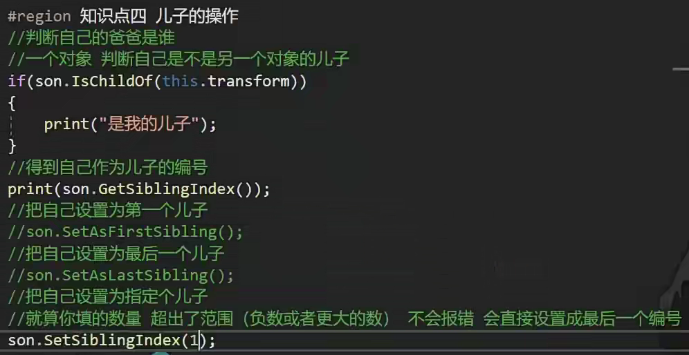

# 父子关系

**list[i].SetSiblingIndex(i)** 的含义是对列表中第 **i** 个元素的 **Transform** 组件所属的游戏对象进行操作，将其在其父级中的层级顺序设置为 **i**。

1.为什么在其他类中能直接引用Sort?

答：因为如果不指定命名空间namespace，则默认是全局 命名空间，在unity项目中的所有位置都可以直接使用Tools类中的静态方法，因为c#中,静态类和静态方法是可以全局可访问的，不需要实例化就可以被调用，扩展方法的参数不是在调用时传递的，而是在定义方法时指定的，这里是this.transform，它会自动引用调用该拓展方法的对象实例

2.（this transform obj）是什么意思，为什么this后面不用.？

答：因为this参数就是告诉编译器这个方法是一个拓展方法，作用就是指定拓展方法的类型

3.顺序：

1.创建静态方法

2.使用list和lamba表达式将transform排序存起来

3.循环使用setsiblingIndex（）挨个将list设置

总结：利用了递归，如果子对象找不到，就循环子对象重写递归调用子对象的子对象
