# 生命周期函数

帧是什么？

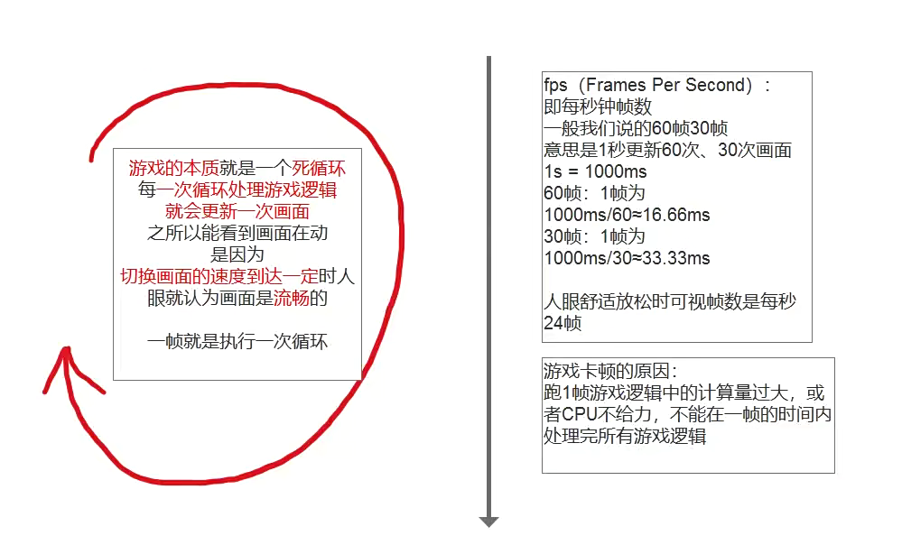

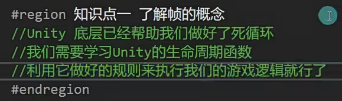

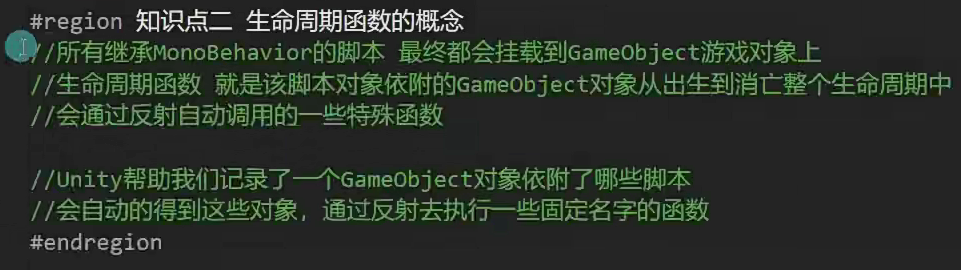

只要在场景里的物体，unity都会自动死循环显示每一帧的画面，物体在死循环的过程中不断的利用反射调用脚本文件

Debug是unity的一个调试类

.log(没有继承)=print(继承了)-->输出信息

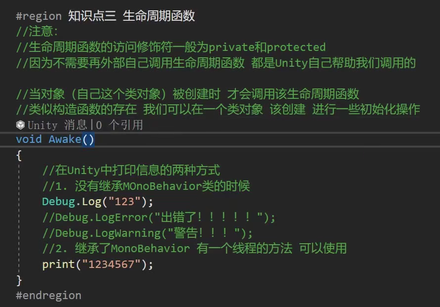

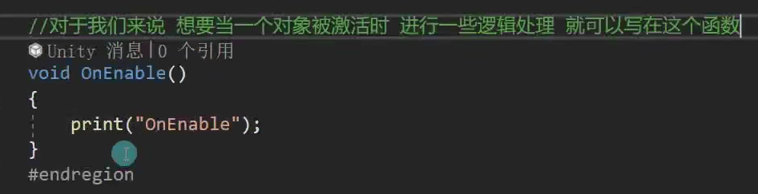

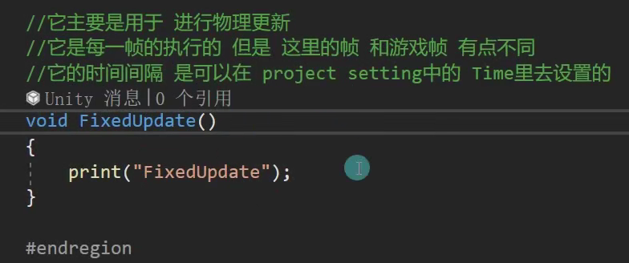

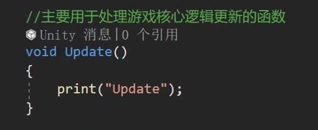

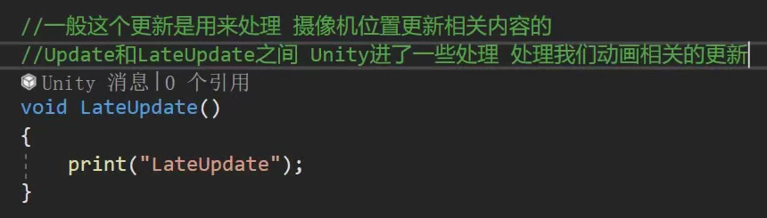

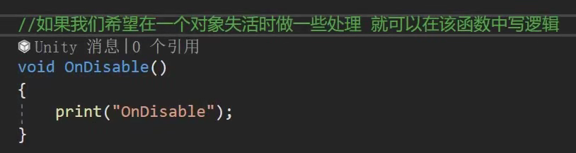

Update和LateUpdate时间间隔一样，不一样的是先执行和后执行

子类要用就用protected保护的，不用可以写private私有的，或者不写也可以

当一个对象出现时会自动调用一次OnEnable,当一个对象销毁前会自动调用一次OnDisable

蓝色只会调用一次

红色只有激活和失活才会调用一次

绿色一直循环调用

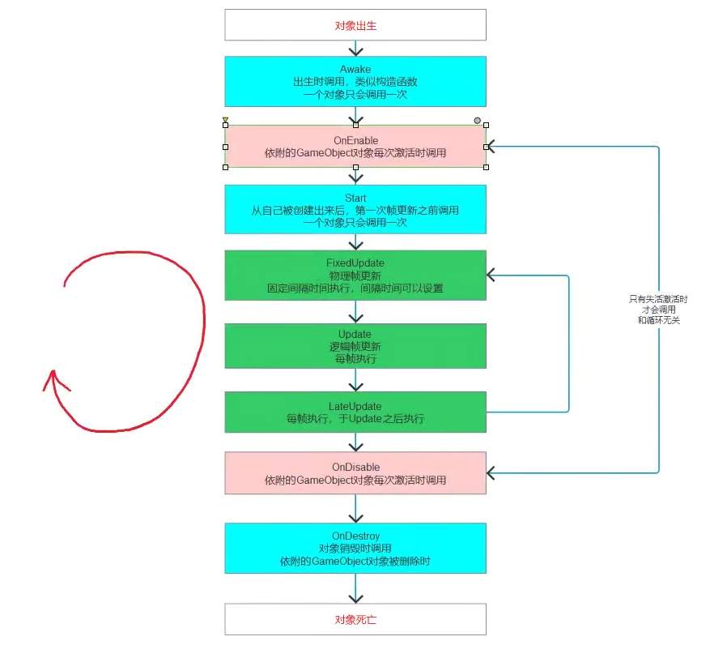

生命周期函数只能写在继承了MonoBehaviour的类中，生命周期函数都是不写参数的

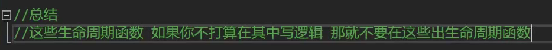

生命周期函数支持继承多态：

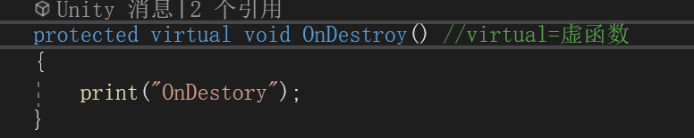

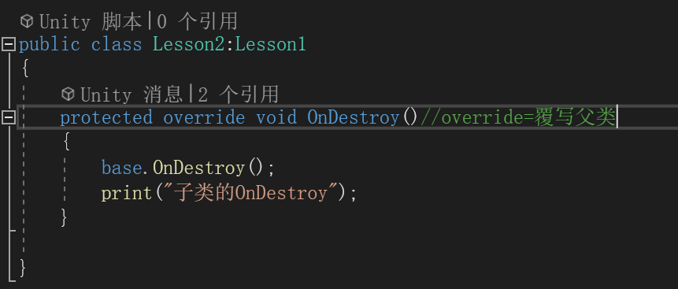

20.脚本基本规则补充 关于继承Mono的类的构造函数

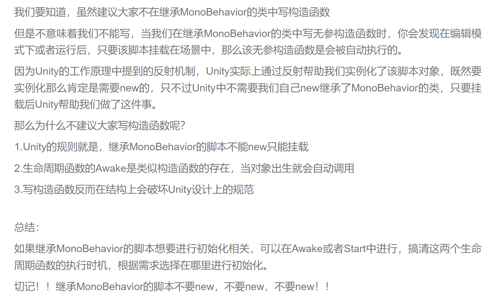

21.不同对象的生命周期函数是在同一个线程中执行的吗？

