# 碰撞检测之刚体加力

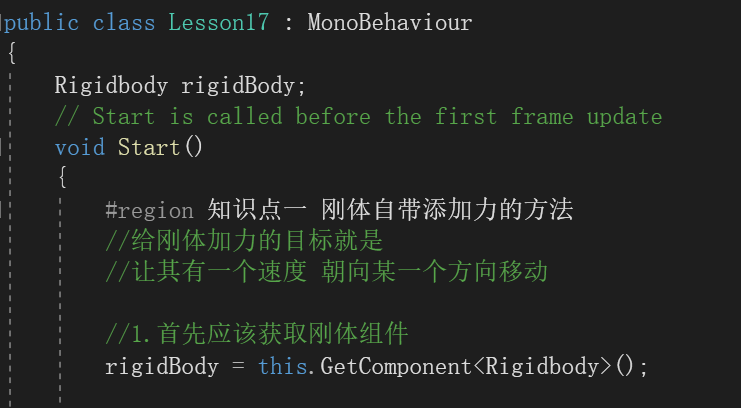

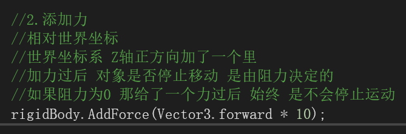

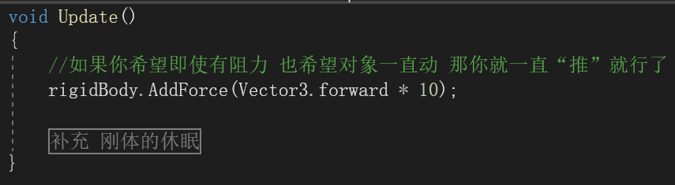

为什么放在update里就可以忽略阻力一直动了？

答：因为update里循环推动无视阻力存在，而start里只会推一下，如果有阻力就会停下来

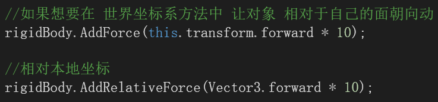

总结：改变移动方向，方向朝自己的方向

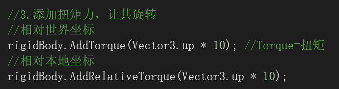

什么是扭矩力？

答：旋转的力

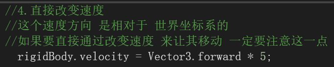

注意：改变速度是相对于世界坐标的

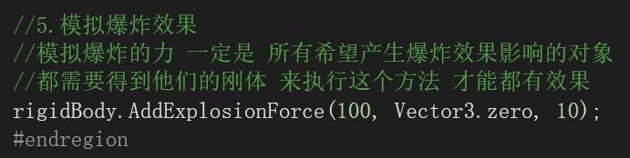

注意：只有添加了爆炸效果的脚本才会有爆炸效果

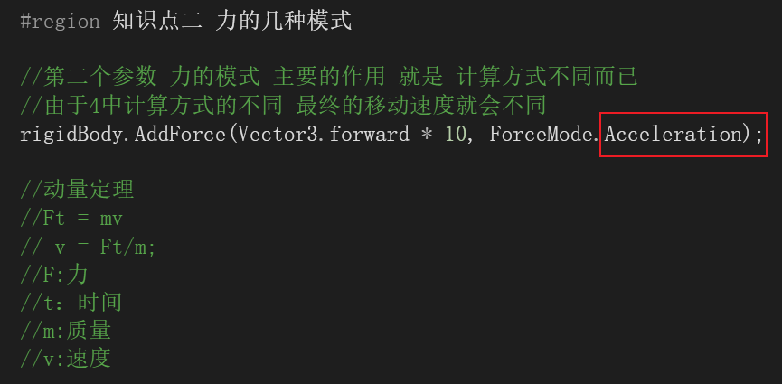

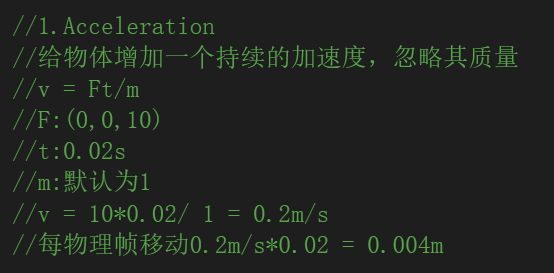

加速，时间越多，加速越快

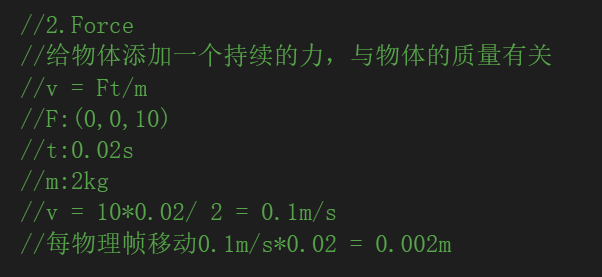

持续的力，质量越小越快

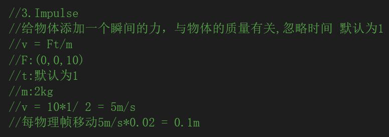

瞬时的力：

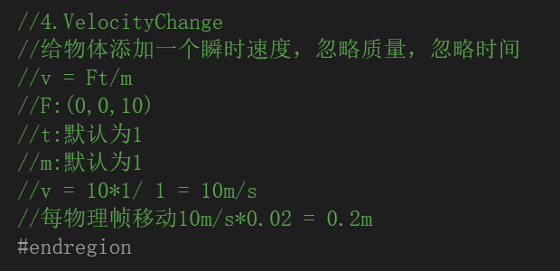

瞬间的速度

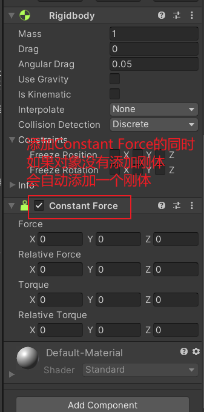

1.拖动

2.刚体加力代码

 Rigibody rigi=this.Getmoment<Rigibody>()；

rigi.addforce(vector3.farward*10);

3.添加constant force

4.改变移动位置代码

this.transform.translate(vector3.farward*10*Time.delatime);

this.transform.position+=vector3.farward*10*Time.delatime;

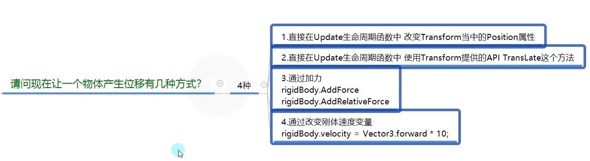
