# 协同程序2

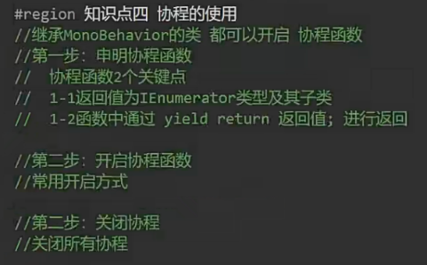

第一步：

WaitForSeconds(5f):unity引擎提供，等待5秒

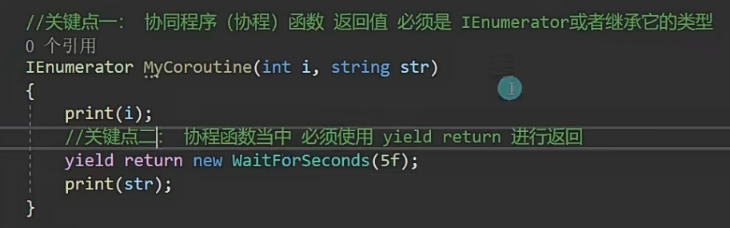

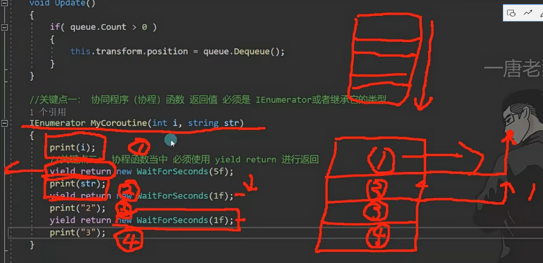

第二步：

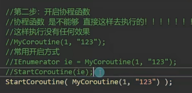

第三步：

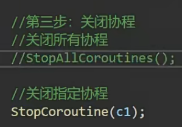

也可以同时开启多个协程程序，然后指定关闭

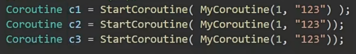

---

---

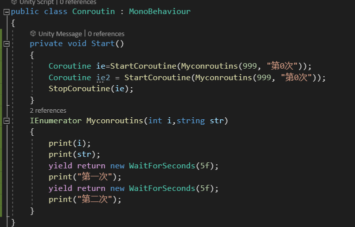

怎么设置无限步？

在里面写死循环

知识点五需要记忆

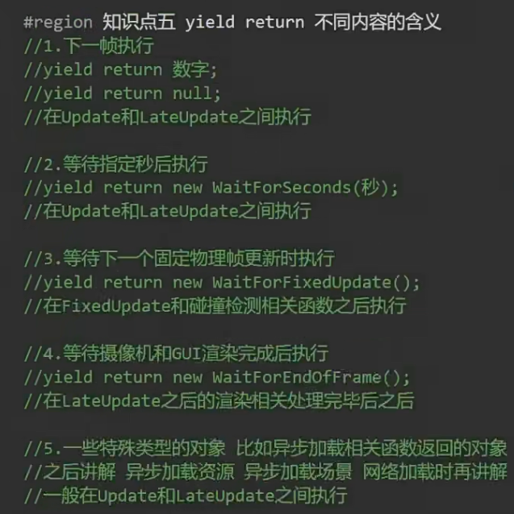

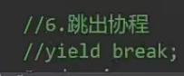

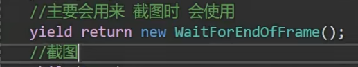

协程只有脚本失活时才继续执行

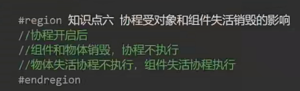

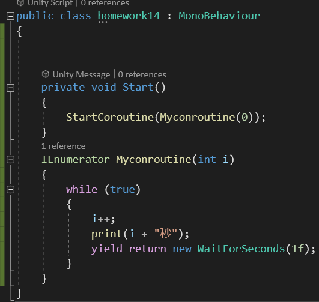

2.

普通的写法：会卡顿

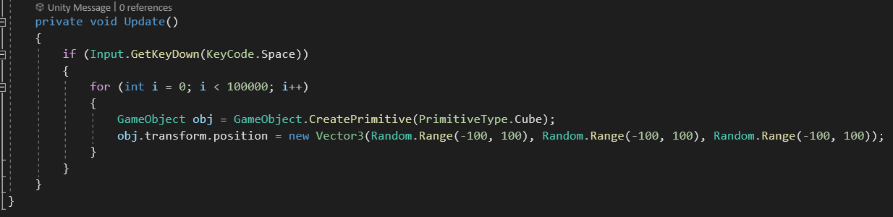

用协程写：每隔1000个立方体停顿一秒

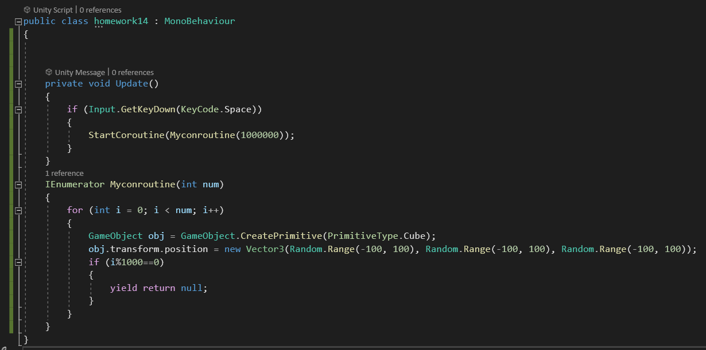
