# 四元数的常用方法

对应的欧拉角就是（0，0，0）

一般用来初始化对象，把对象的欧拉角全部设成（0，0，0）

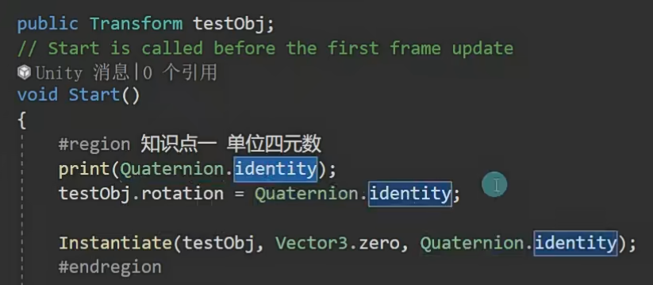

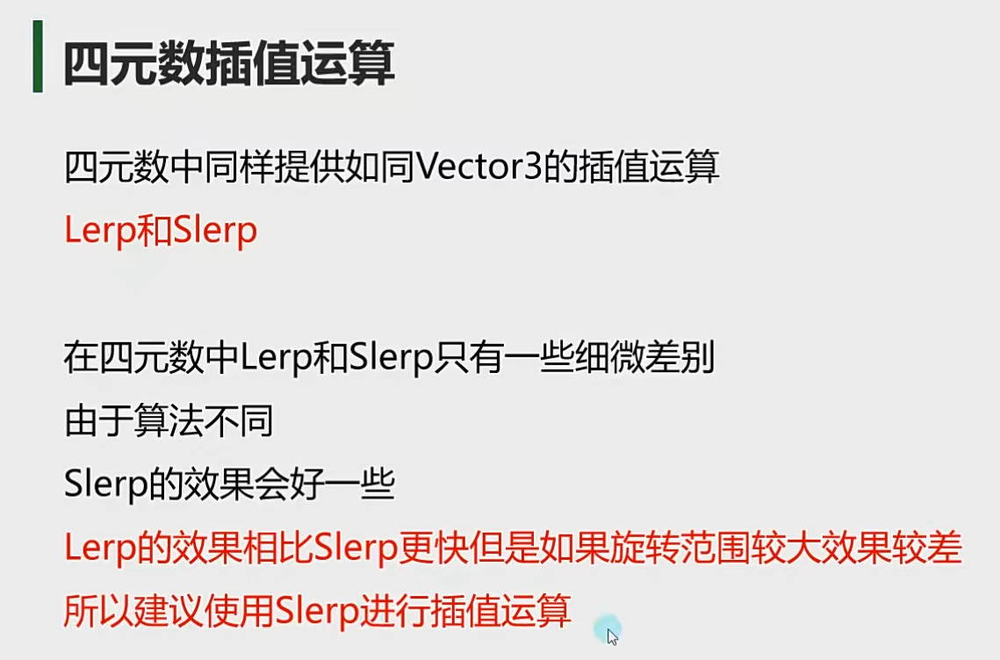

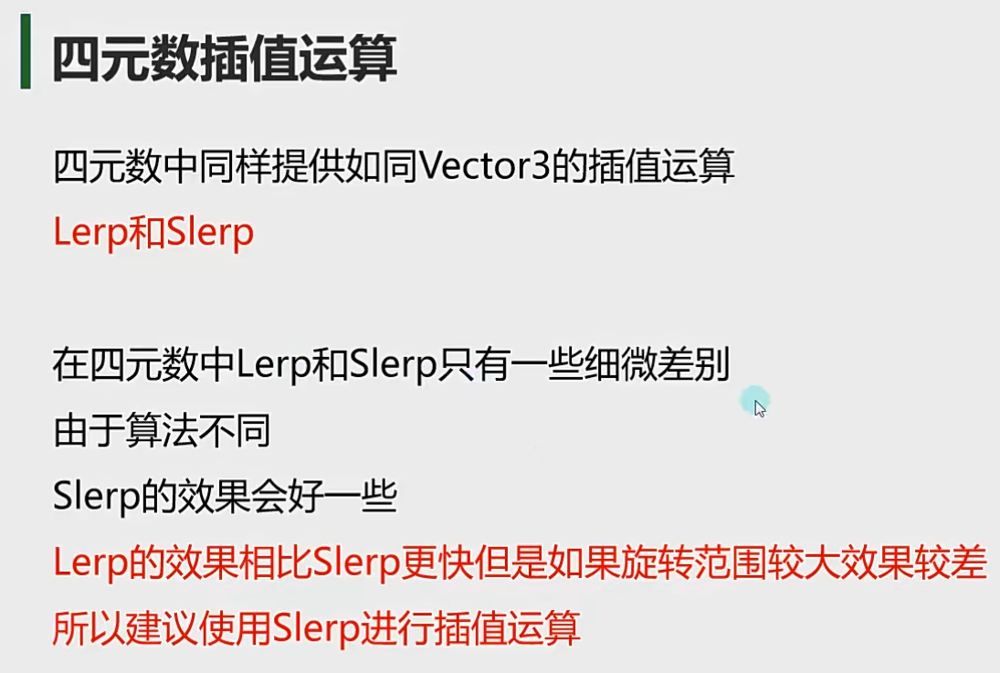

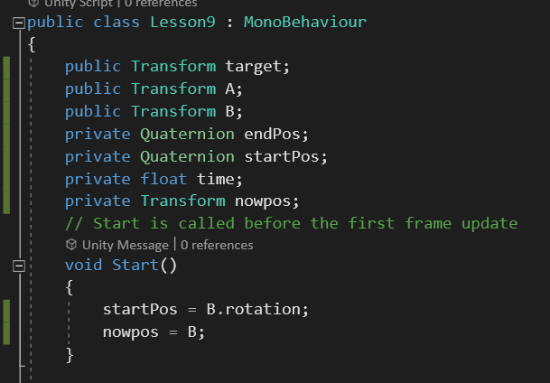

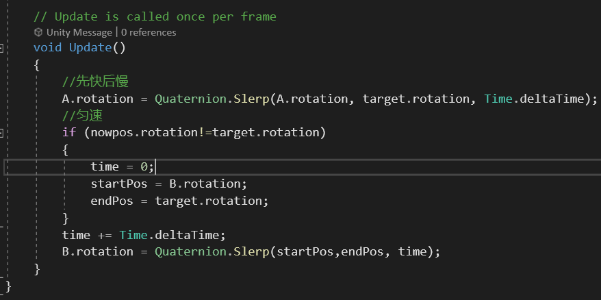

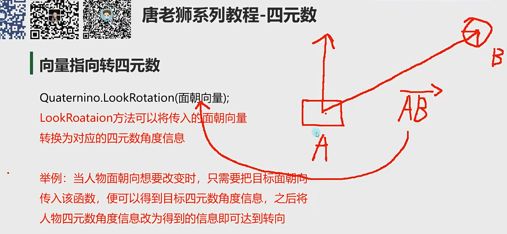

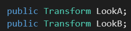

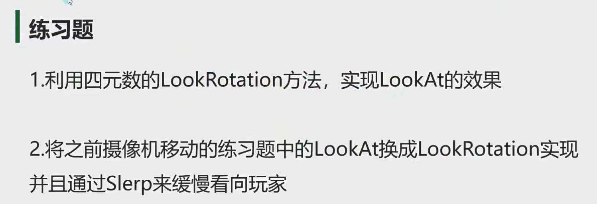

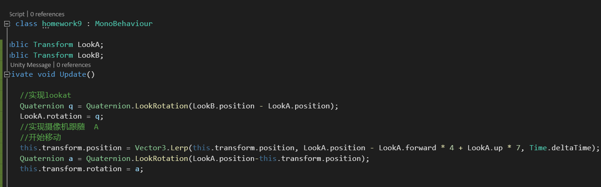

1.假设没有LookAt,用C#拓展一个方法写

静态类，静态方法

MyLookAt 方法被定义为 public static。这意味着它是公共的，并且可以通过类名直接访问，而不需要创建 Tool 类的实例。所以其他类可以直接引用该方法，而不需要先创建 Tool 类的对象。

static 关键字使得成员（字段、方法等）不需要通过对象实例来访问。这使得它们可以在程序的任何地方直接调用，而不需要创建类的实例。

this会把所有调用这个工具类的对象将他们自身先传进来

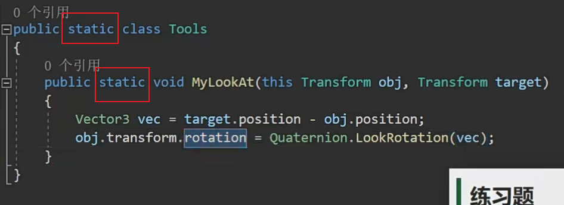

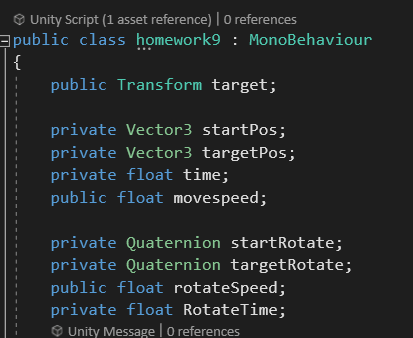

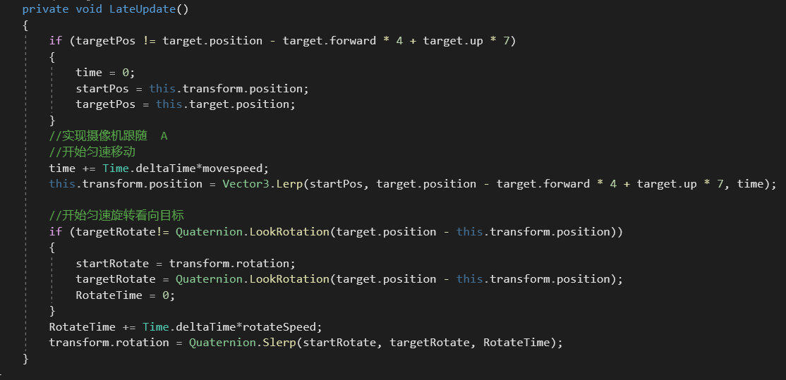
