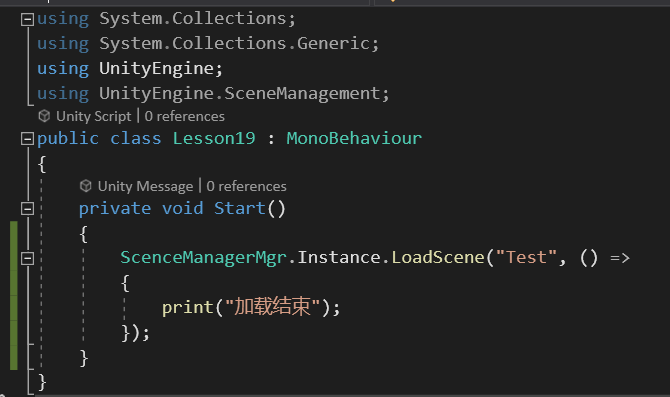

# 场景异步加载

事件回调函数是场景加载结束才执行逻辑

协程异步加载是场景加载途中就执行逻辑

但是为什么通过事件回调函数就不会有这种情况？

因为事件回调函数是把某一个对象的函数存入到了事件里，即使场景上删除了，但是在

内存中还存在着，除非被垃圾回收机制回收内存。即使触发了垃圾回收，但是函数是被我们存入到了事件里面，在垃圾回收时会进行判断，这个事件是不是有东西占用着，这个事件就不会被释放掉

协程协调机制会在协程删掉后删掉所有东西

如何协程让一个对象过场景时不被删除？

DontDestroyOnload( );

协程场景异步加载对我们来说有什么作用？

