# PalyerPrefs基本方法 知识点

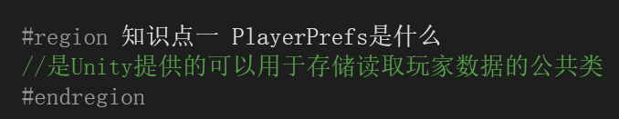

学的是这个类中所有API的调用

---

---

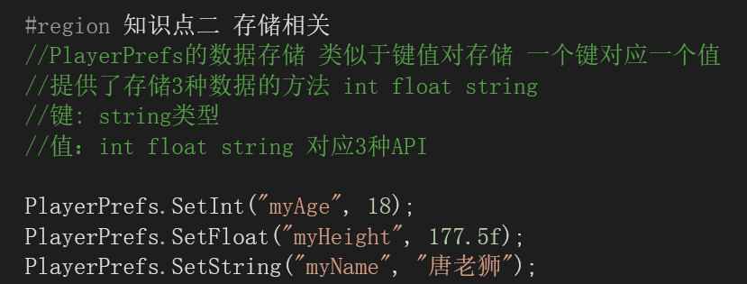

存储类型：键值对存储，eg:买货标签，猪肉糖：4块

三种存储类型：int,string,float

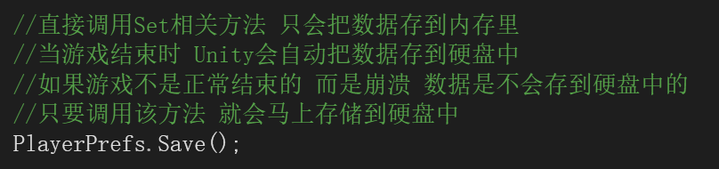

1.写入到内存，游戏结束统一存储到硬盘

2.崩溃时会数据丢失

3.如何避免数据丢失？Save（）方法，马上存到硬盘

1.其他类型怎么存储？强转，将一个高精度的数值用低精度类型装，所有不能用的类型用相近的类型强转用，double类型的变成float，eg：杀猪焉用牛刀，杀牛的刀用来杀猪

2.bool类型怎么存？int存0或者1，用的时候判断1是true，0是false

3.同一键名都会覆盖

---

---

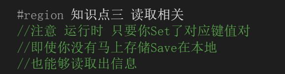

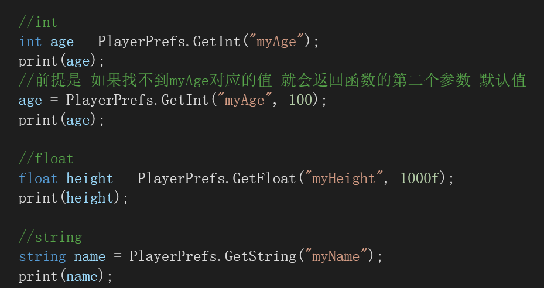

---

1.int,float默认值是0,string默认值是空，没有找到会返回默认值

2.游戏开始会优先从内存中拿取数据，没有再去硬盘寻找

3.默认值的作用：玩家开始时的初始战力

---

---

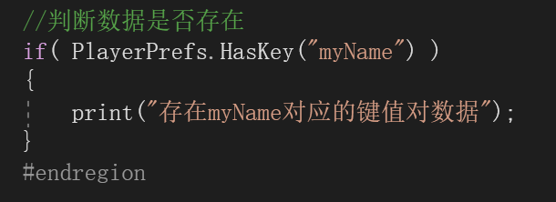

1.作用：存储多个数据，判断两个键是否重复，避免想要使用相同键，但是不同数据间的覆盖，存在就改个名再存

---

---

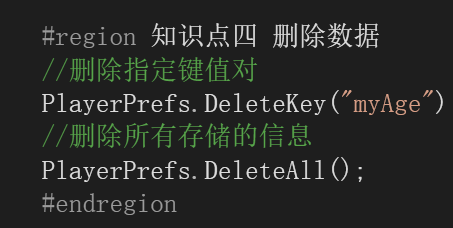

1.指定删

2.全删

---

---

习题：

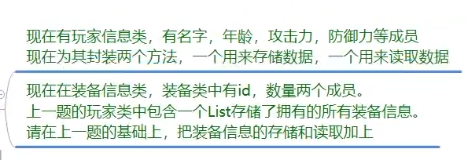

习题一：

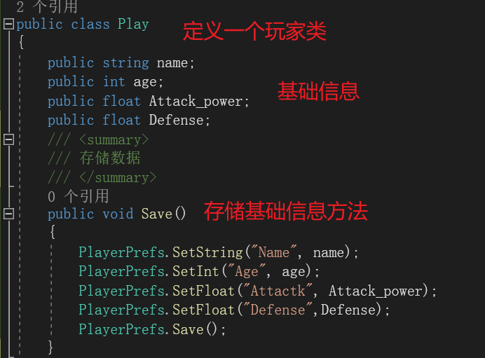

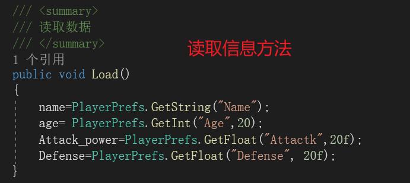

1.自定义玩家类，定义基础信息，两个存数据和拿数据的函数方法

2.使用：声明类对象，然后类对象调用方法

习题二：

如何存储list？

自定义存储规则

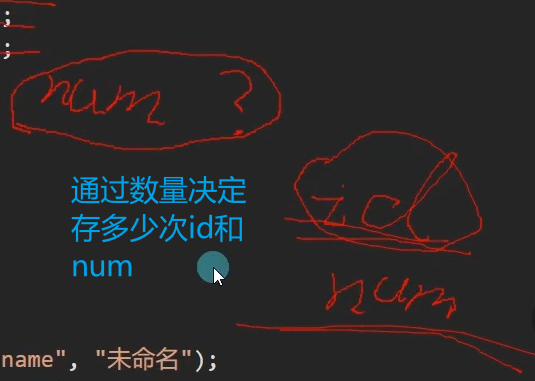

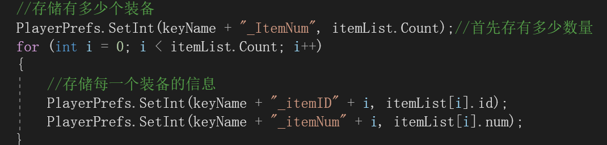

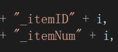

自定义存储规则，因为重复的键值会覆盖，每次加一就不会被覆盖了

---

---

1.首先定义一个装备信息类，包含数量和id

2.玩家信息中定义一个装备信息类类型的list

3.Save()函数中将列表存入,如果列表空，则把数量为0传进去，因为，在load里获取对象才能获取到，也可以直接写 PlayerPrefs.GetInt("nums"，0);默认返回0，如果列表有值，则依次存入

4.load()函数将Save()中存的键值对依次取到装备信息类中的变量存起来

5.在start（）函数中定义类对象，实例化list，然后就可以调用load（）加载了，用for循环可以对列表中的id和数量进行操作了，如果修改数据，直接调用save()保存就好了

list公共变量如何在其他类中实例化？

答：因为list是一个公共变量，但是又是在其他类中实例化，所以首先创建类对象，用类对象调用才能来实例化

list如何在其他类中使用？

答:c#中有值类型和引用类型，值类型的变量会在声明的时候直接分配到内存空间，这个内存空间就是用来存储这个值的，而不是引用到另一个内存空间，公共类型的值类型变量都可以在其他类中直接使用，引用类型就需要创建类对象，通过类对象来使用，常见的类对象有：类，数组，接口，委托，字符串，list

列表为空时，list.count是多少？

答：0

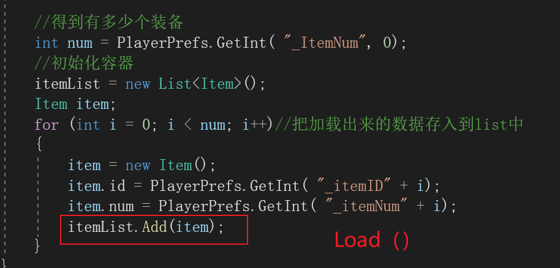

这句的目的是将从硬盘中加载的数据添加到列表中，确保列表中包含了所有的数据。即使列表中原本没有数据，这样做也可以确保列表中包含了所有正确的数据。

---

---

全部代码：

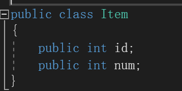

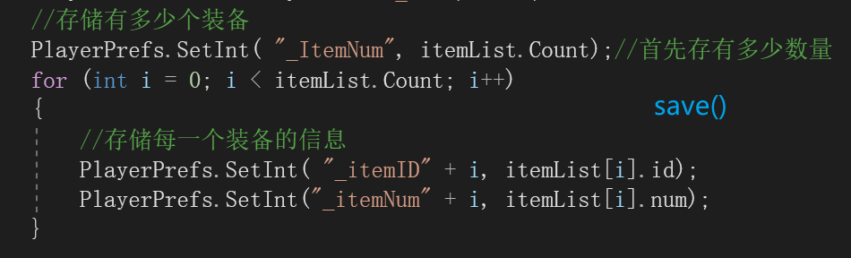

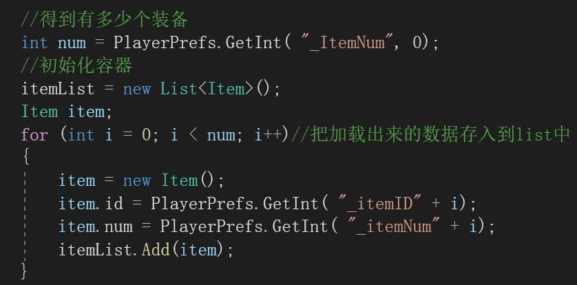

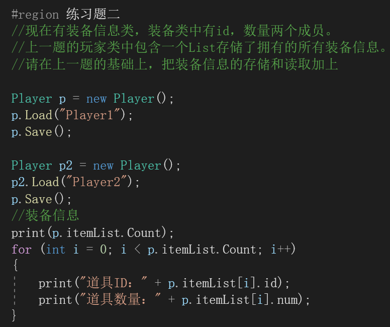

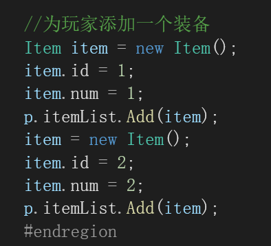

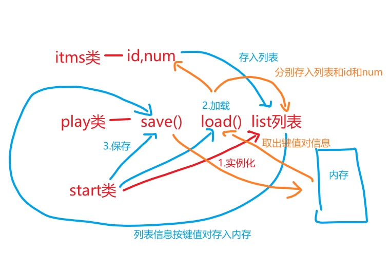
