# AnimatorController动画控制器状态机

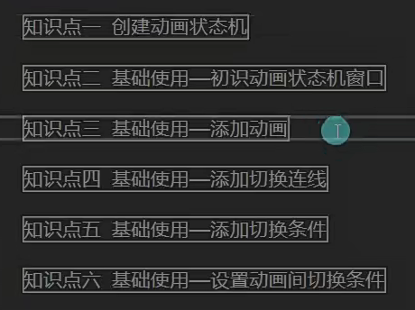

1.为一个对象创建动画时会自动创建状态机文件

2.手动创建状态机文件按

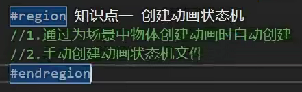

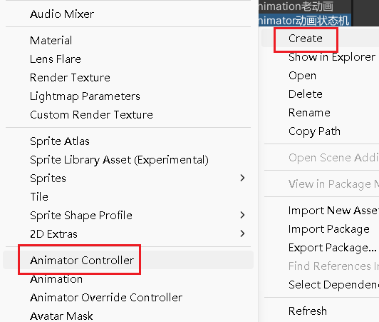

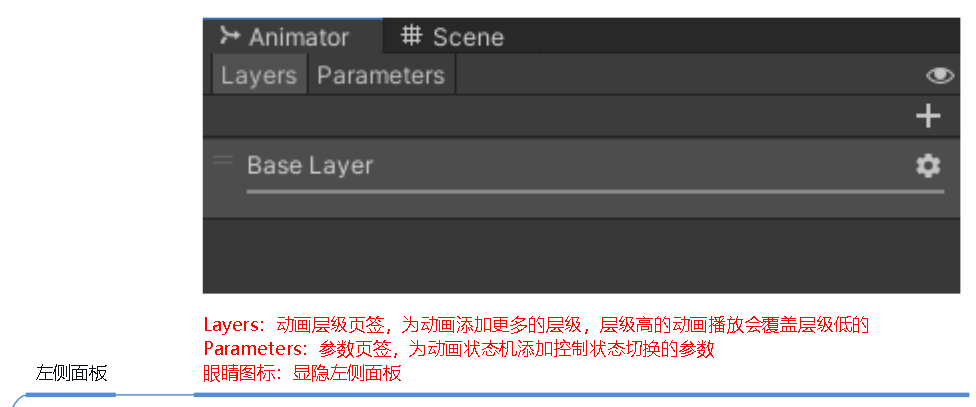

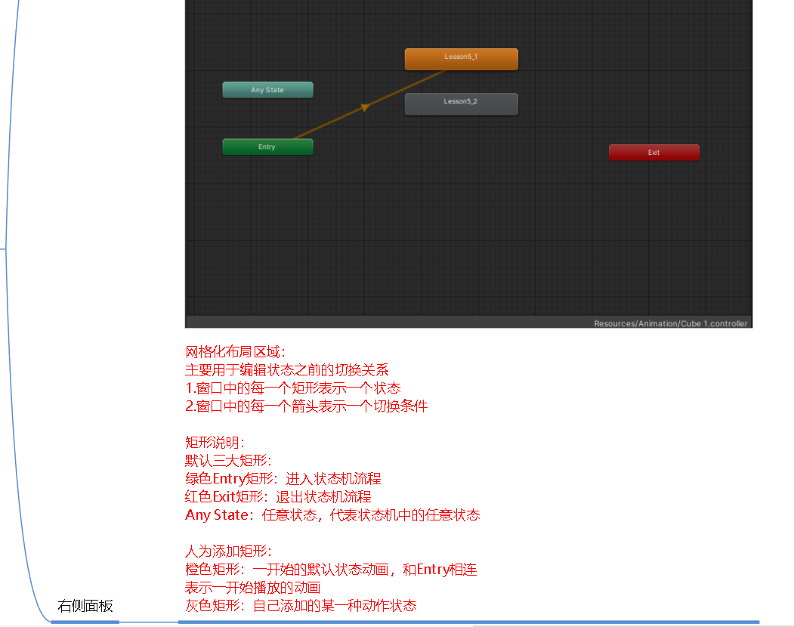

补充：

层级覆盖主要看权重的多少

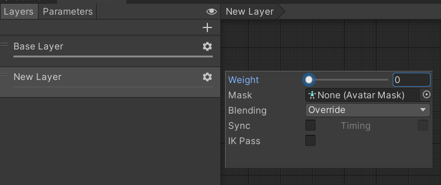

状态：

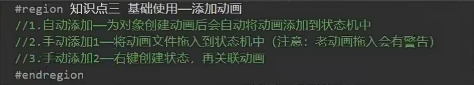

切换状态：

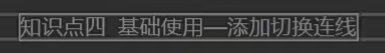

设置连线

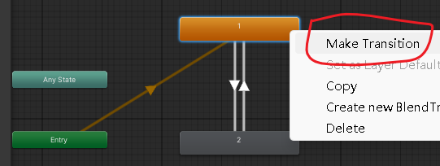

设置本层默认动画

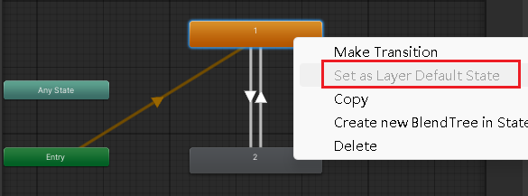

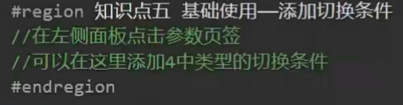

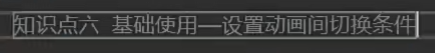

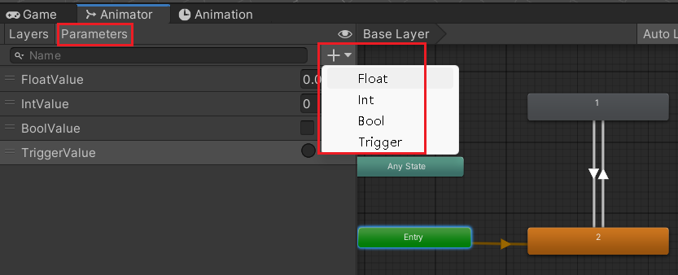

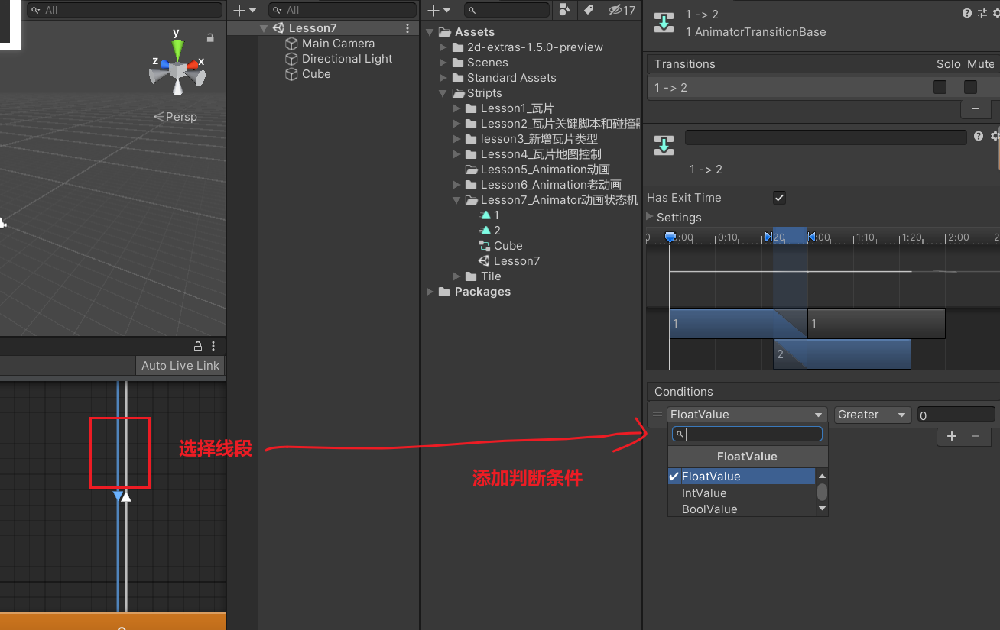

可以添加多个动画，只有所有的条件都满足了才会执行后面的动画

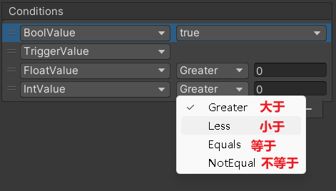

特别注意：

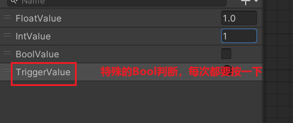

eg:

没按一下TriggerValue同意，就会执行一次2，然后再次切换到1，等待下一次Trigger

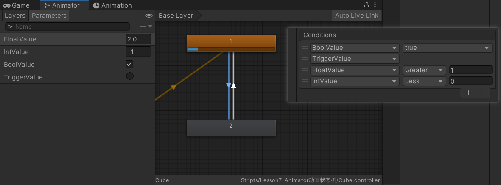

动画状态机的设置

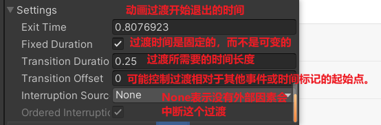
