# SpriteRender精灵渲染器

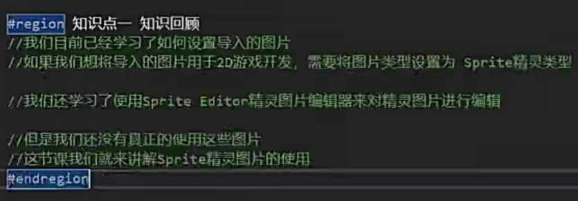

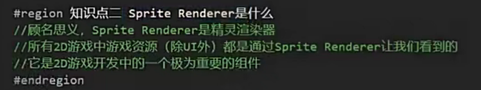

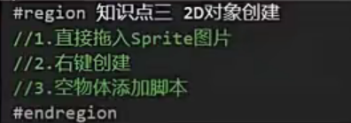

1.直接拖入

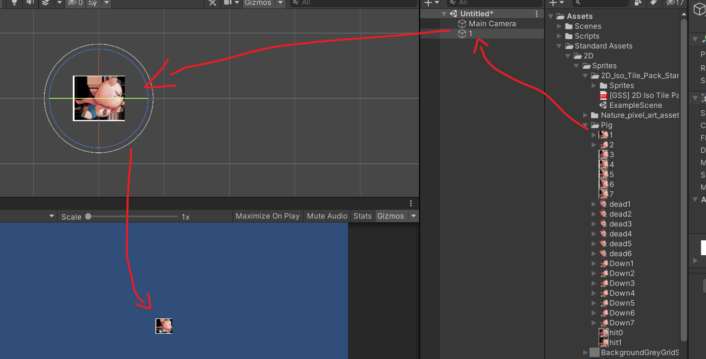

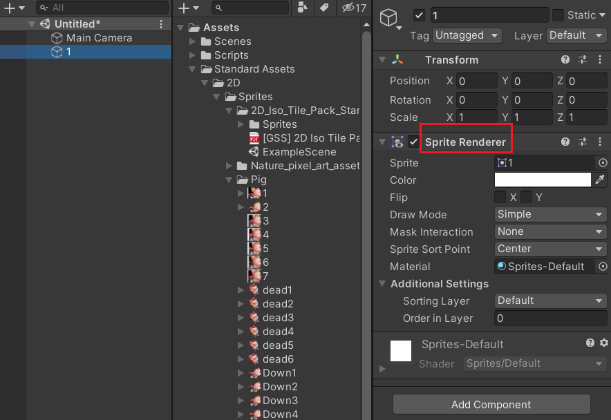

2.右键创建

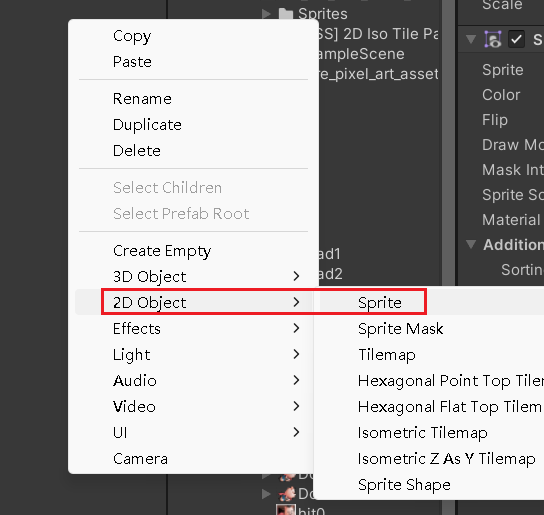

关联

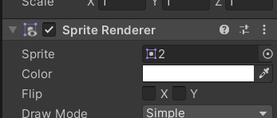

3.空物体添加脚本，重复步骤2

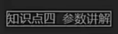

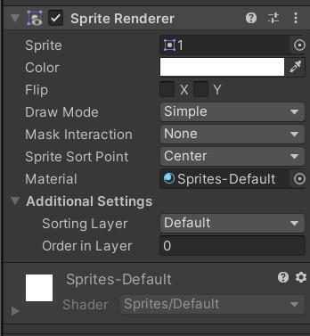

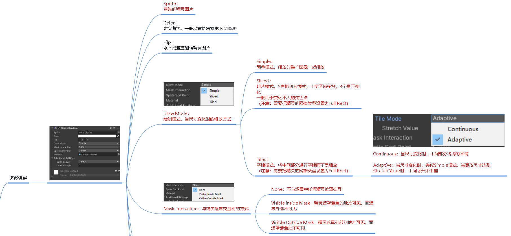

                                                  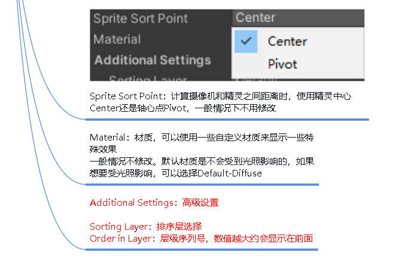

---

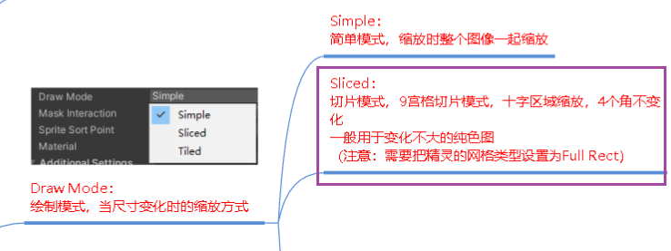

切片模式的原理，只有中间十字区域缩放，原图片必须是full rect类型

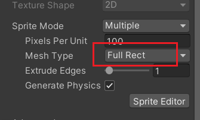

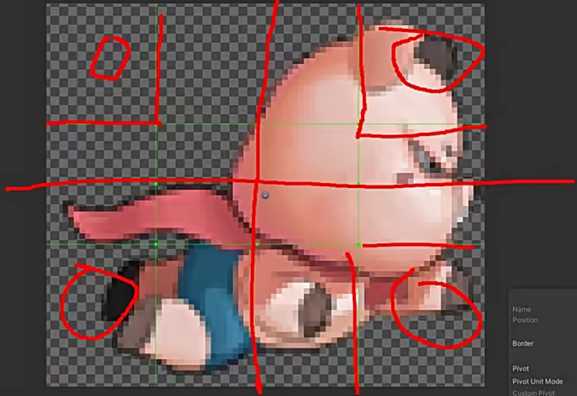

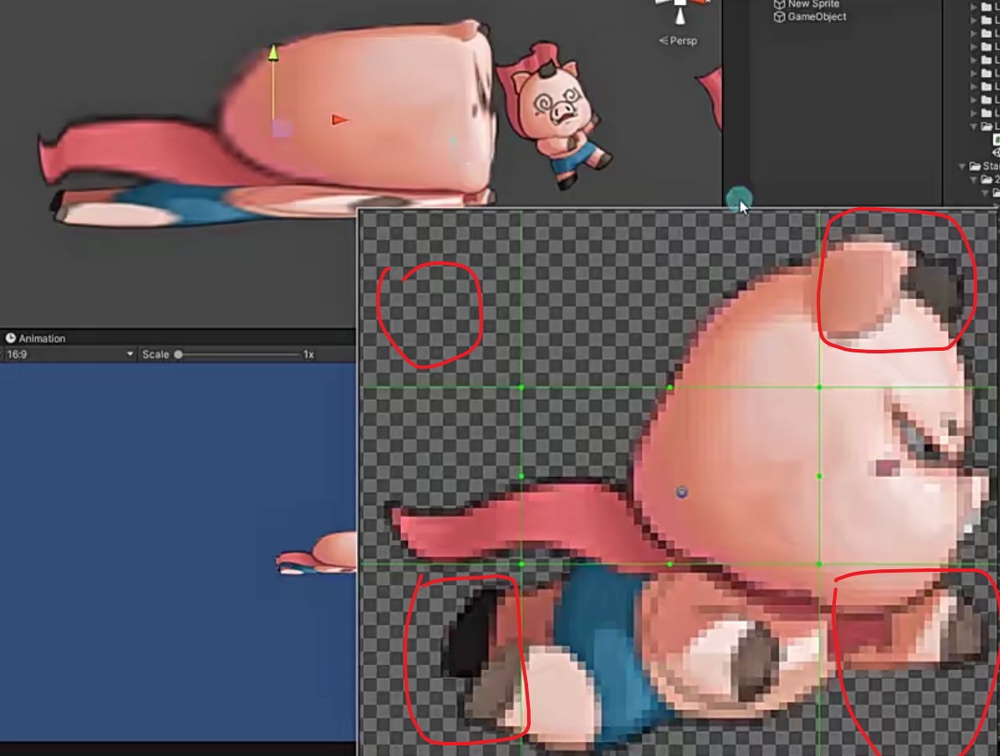

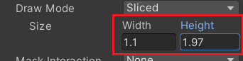

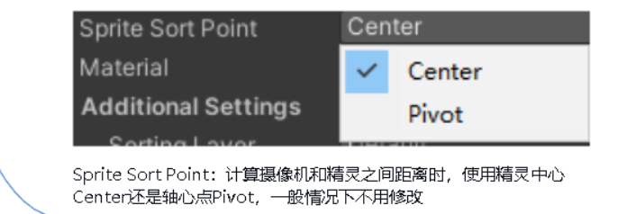

轴心点是自己设置的，那个圆圈，center就是图片中心

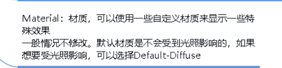

选择2D游戏是否需要光照影响之类的

新建的层会显示在前面

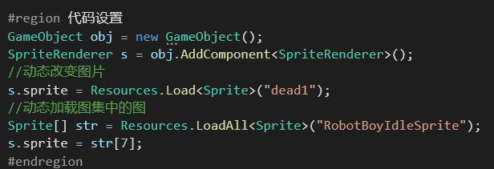

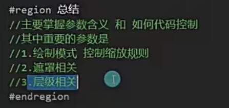

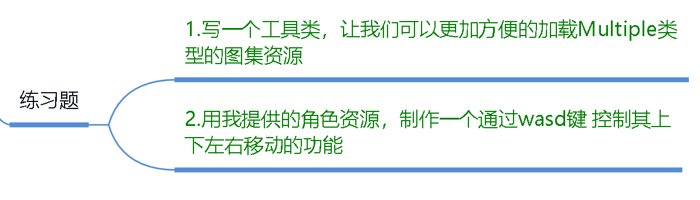

自己写的

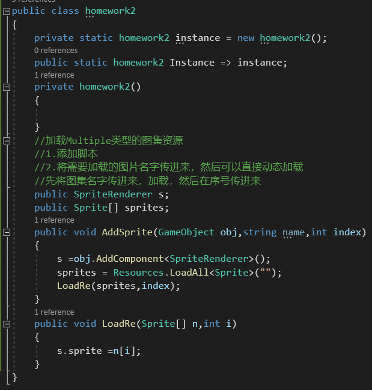

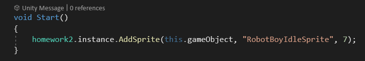

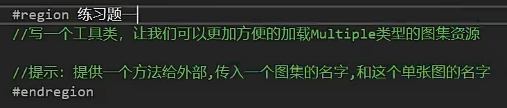

思路，将整个图集存入到字典中，然后再循环将具体的图片存入到字典中

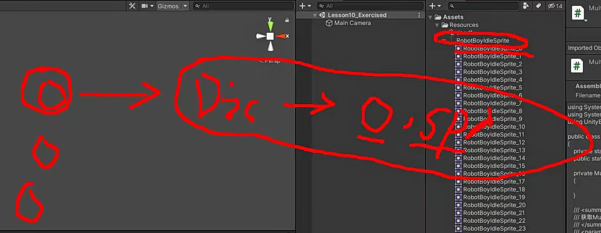

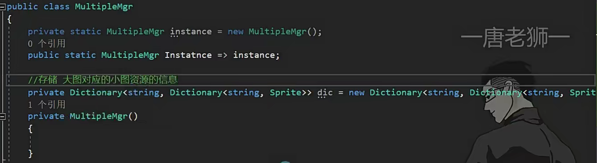

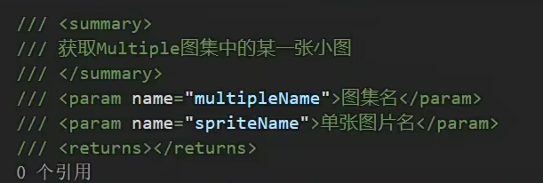

传一个大图和小图名字

如果有大图则直接传回去小图

如果没有大图就动态加载并且存入到字典中，如果有小图则传回去，没有则返回null

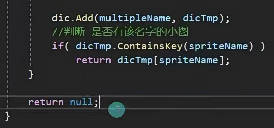

删除图集就是清空字典和卸载资源

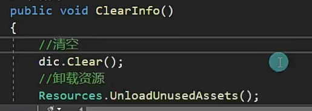

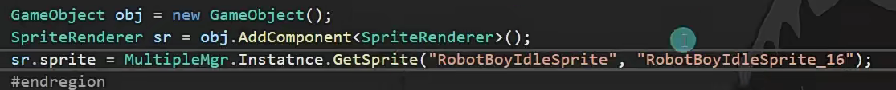

自己重写

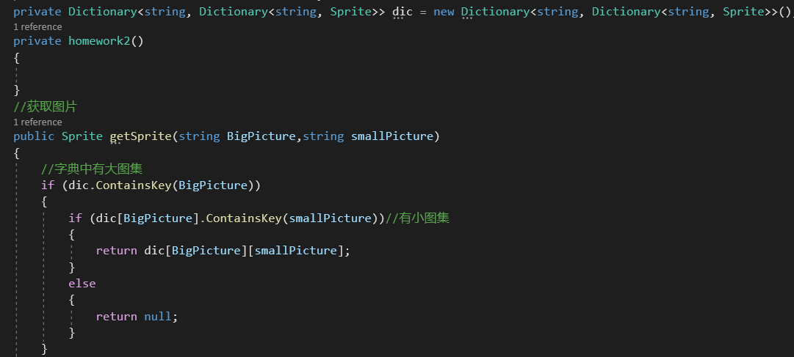

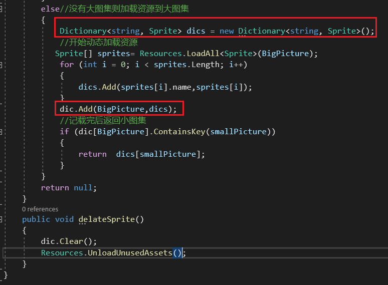

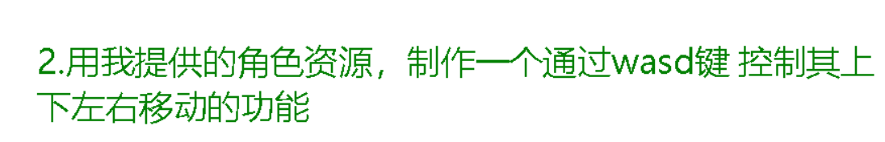

注意：1.图片的轴心点最好在脚下，buttom

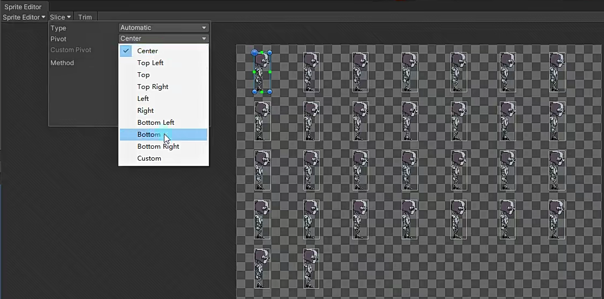

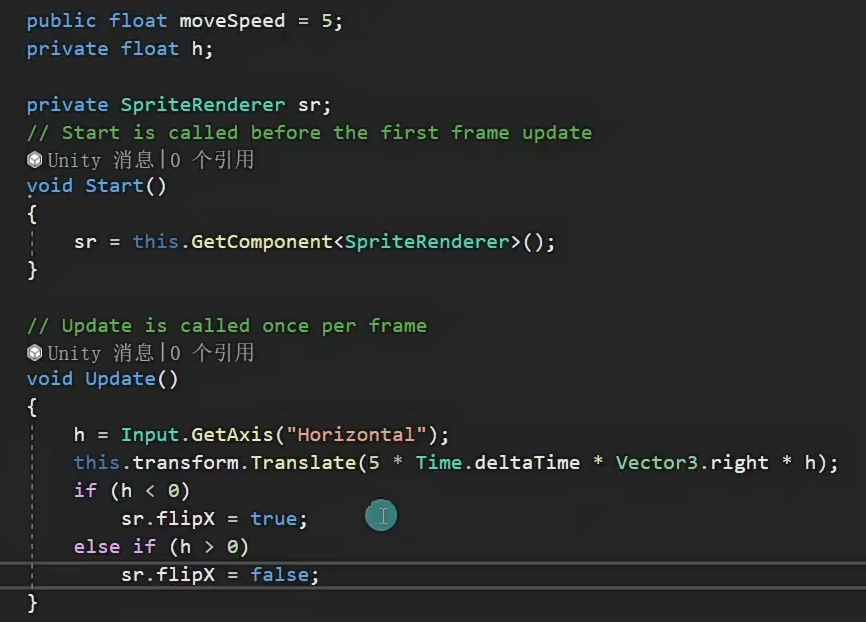
