# 代码控制动画-老动画系统

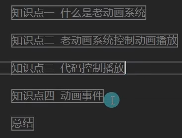

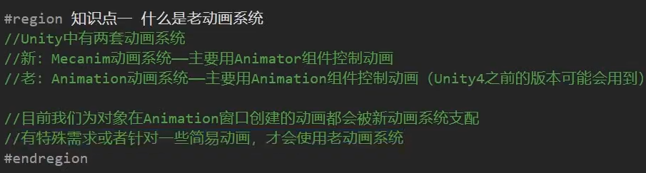

老动画系统如何创建？

和新动画系统几乎一样，唯一不同就是在创建之前需要先给对象添加一个Animation脚本，这样unity就知道创建的是老动画系统了，且老动画系统创建出来是没有动画状态机的，对象也不会自动创建Animator组件了

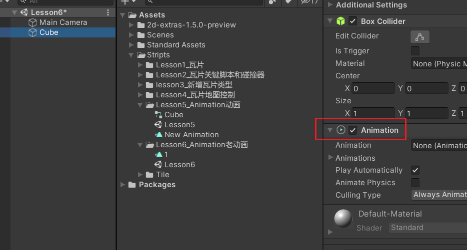

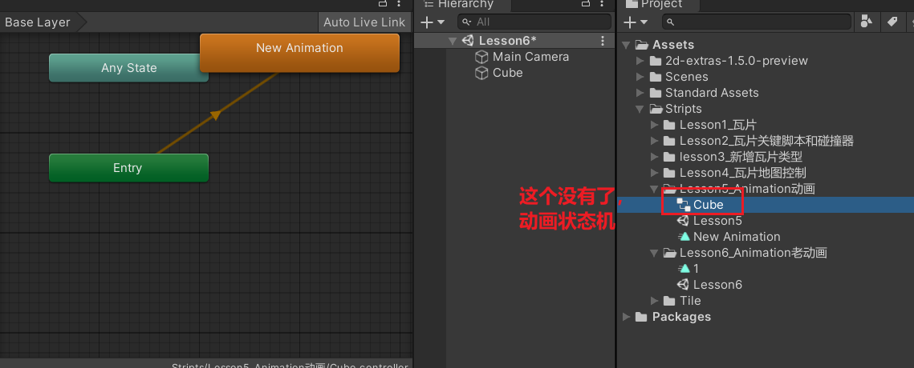

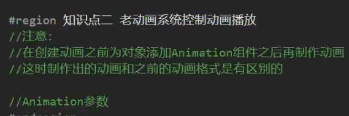

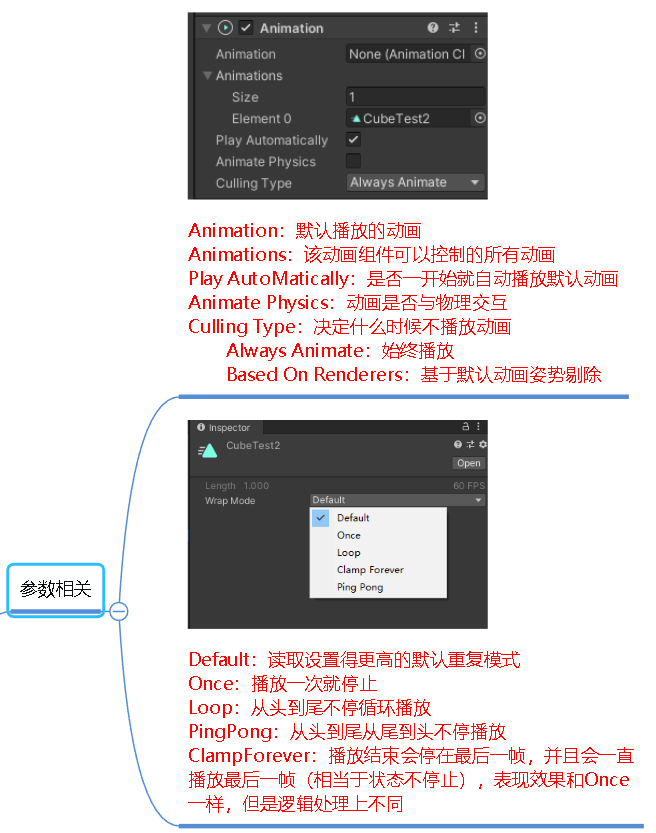

 

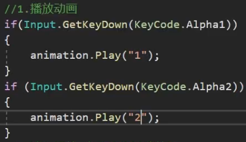

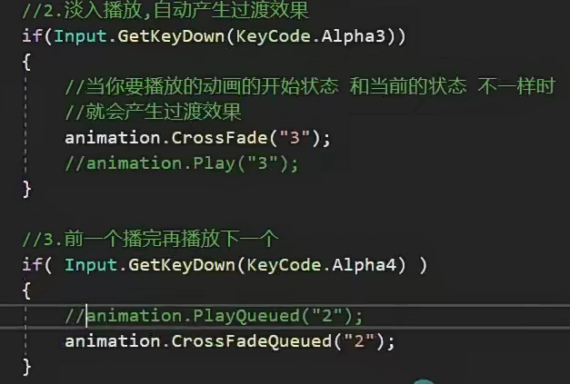

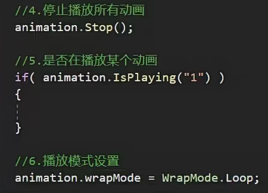

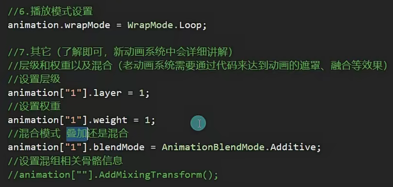

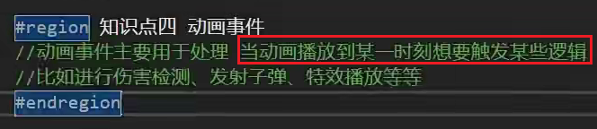

1.添加事件

2.脚本中写事件处理函数

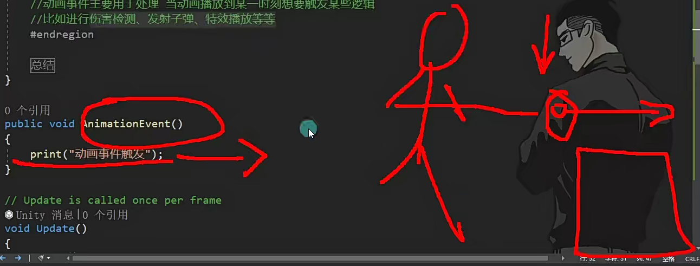

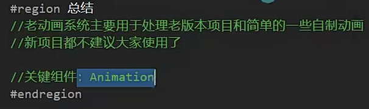

1.拼身体

2.可以用根物体控制子对象的Animation动画，有坑（必须给每个关节打上关键帧）

在跟物体添加Animation老动画脚本和动画文件，这个动画文件可以控制子物体的动画

3.做移动相关逻辑

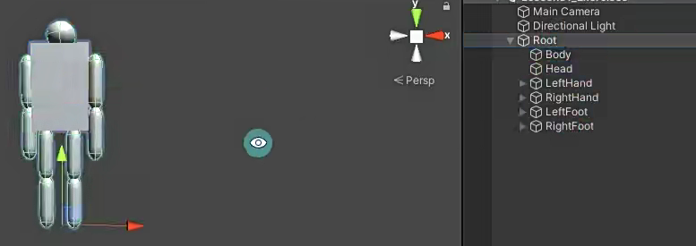

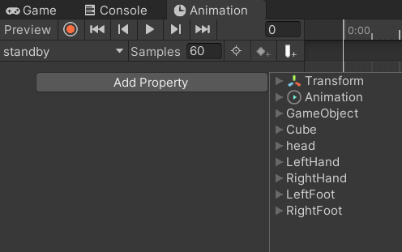

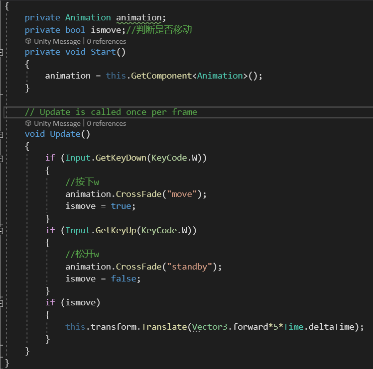

坑：

w松开切换到待机动画关节不会变回去

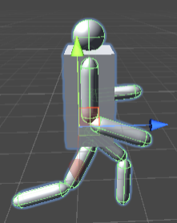
