# 瓦片调色板窗口

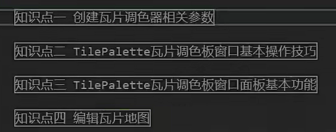

知识点一：

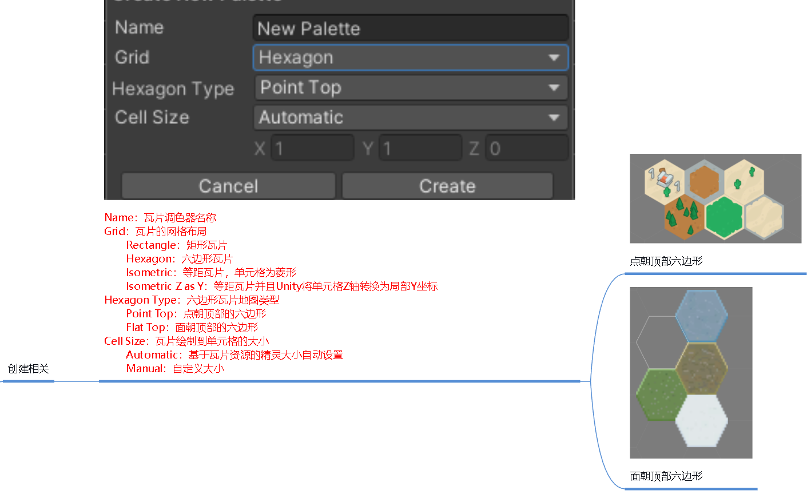

知识点二：

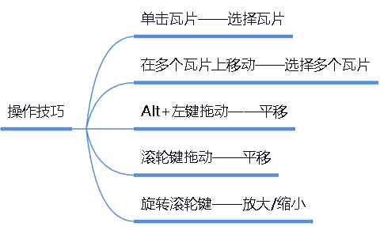

知识点三：

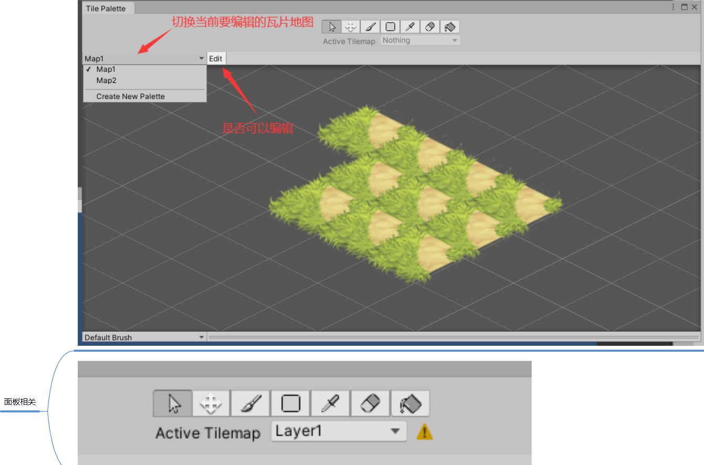

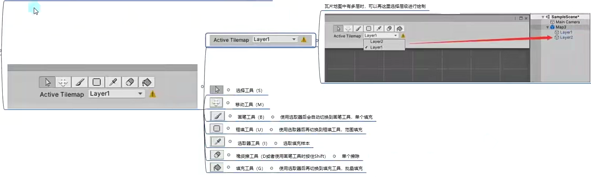

方法一不常用，多用方法二

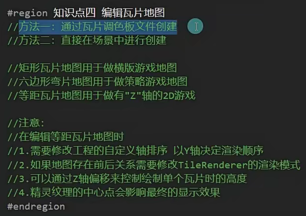

方法一直接在调色板里面进行编辑，Edit必须打开才能编辑，关闭即保存

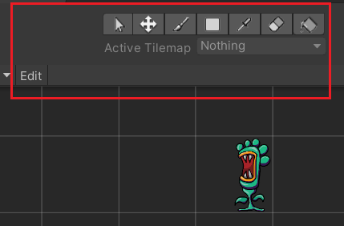

1.如果通过调色板文件直接拖到场景中，则必须把这个脚本打开，才会在场景中显示

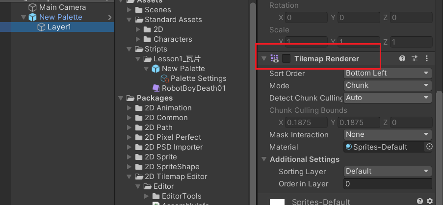

方法二：

1.将所有素材一次性拖入到调色板中

2.Hierarchy面板创建不同类型的面板

3.直接在调色板吸取图片，然后在Scence窗口进行绘制就行了，调色板相当于颜料盘，Scence窗口就是画板

4.可以设置层级关系，Tilemap

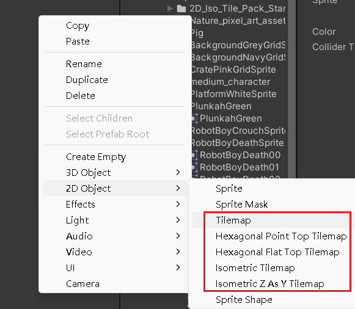

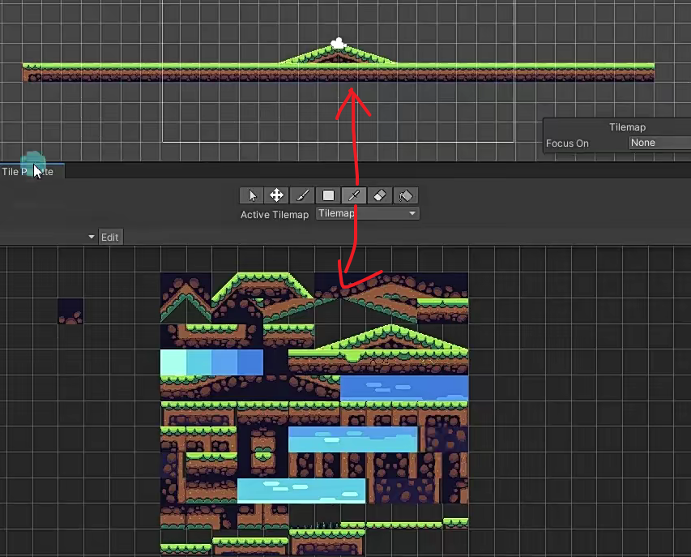

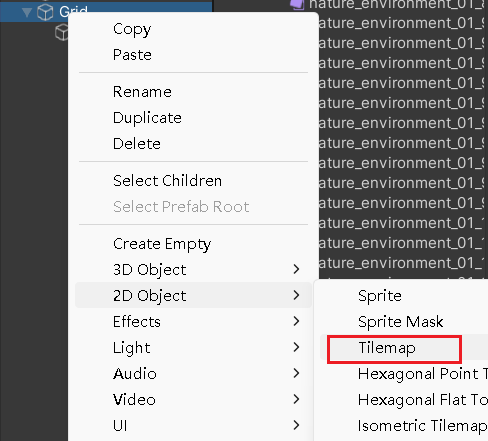

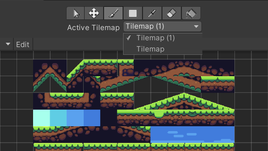

等距瓦片应该怎么去使用，其他的都一样，因为等距瓦片有y轴存在，会有高度差，所以要改变图片的轴心点，然后才能贴合

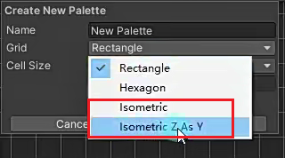

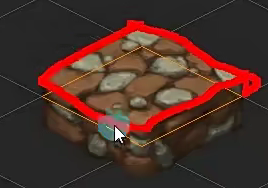

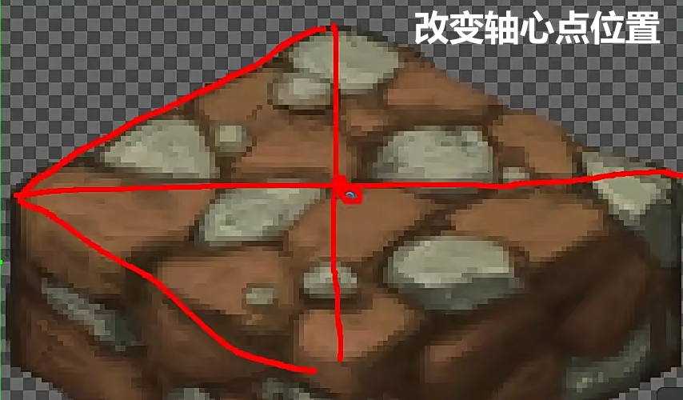

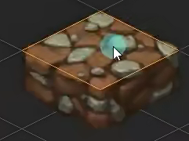

因为Scence窗口没有等距瓦片的概念，所以可能出现排序错误，所以得设置Project Settings，轴距改成自动，xyz改成官方提供的数据 0 1 -0.26，然后再改变TileMap的渲染模式

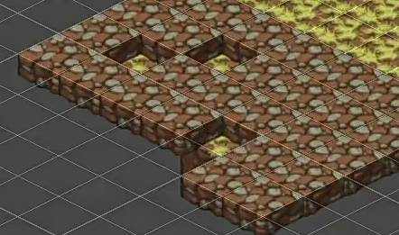

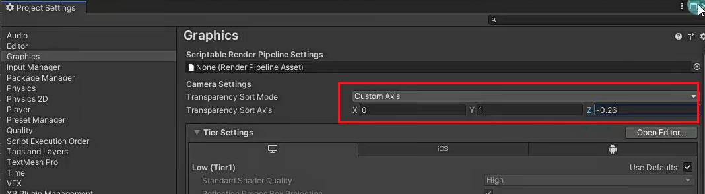

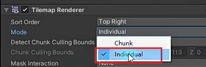

如何不改变轴心点的位置把高低设置准确？

把笔刷的功能打开，就可以按-+在scence窗口改变上下位置，这里是在scence窗口用y轴模拟z轴

在同一个菱形范围可能出现不同z轴的图片，实现漂浮效果

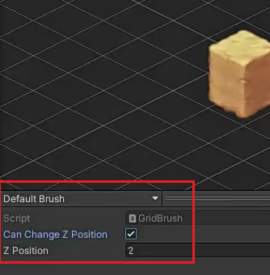

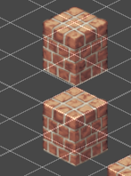

等距瓦片分层是用于放置前置草一类的东西

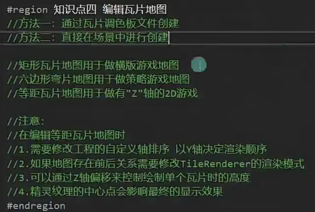
