# （有时间再过一遍作业）瓦片地图关键脚本和碰撞器

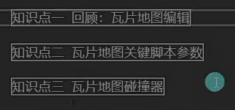

瓦片地图对象上依附的关键脚本

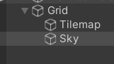

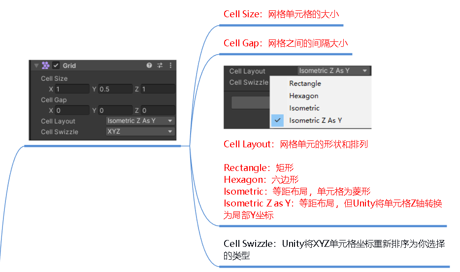

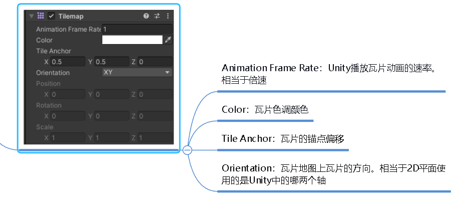

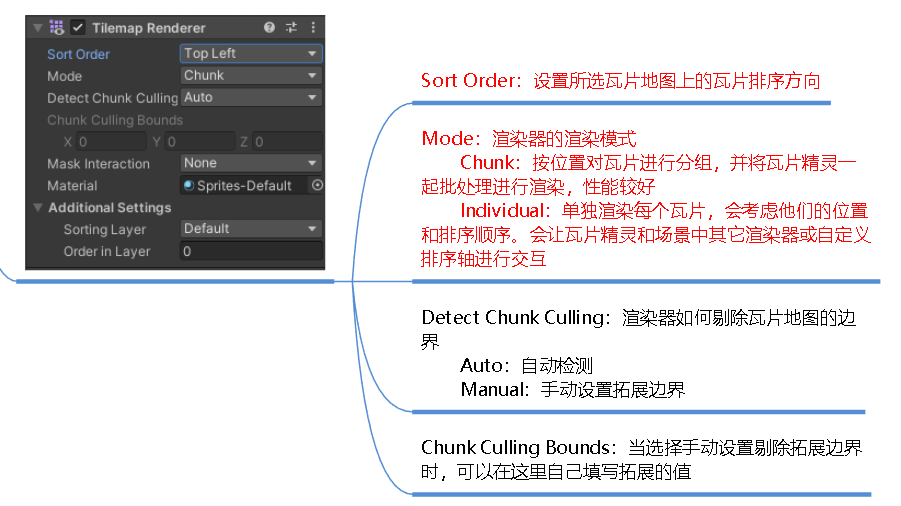

Grid脚本改变了网格大小以后，可以调整图片的Pixels Per Unit一个小图一个单位对应多少像素，一般x2或者/2来改变 美术资源大小不太合适就改变这里调整到合适

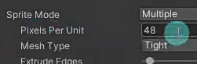

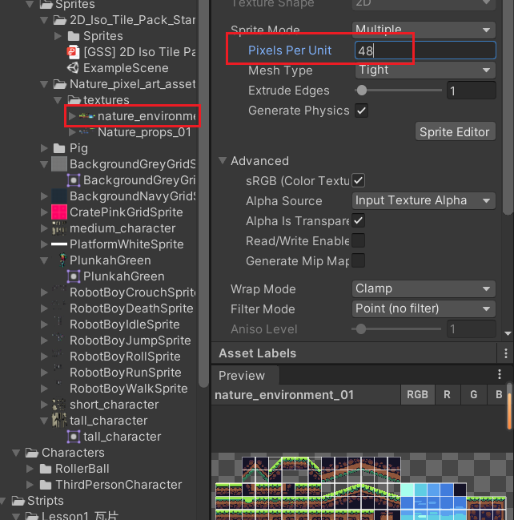

如何添加碰撞器？

只要图片类型是sprite或者grid就可以生成碰撞器了，前者按照图片类型去生成，后者按照格子生成

然后点击添加碰撞器就可以了

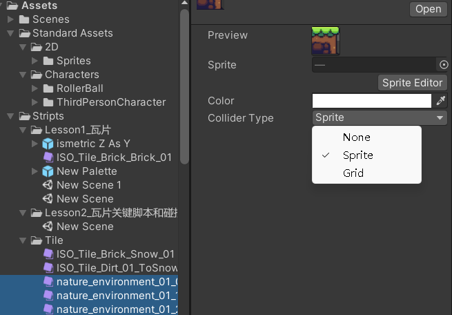

如何优化资源，因为生成的碰撞器都是一个一个的

1.复合碰撞器+瓦片资源碰撞器

2.将不需要碰撞器的图片类型改成None

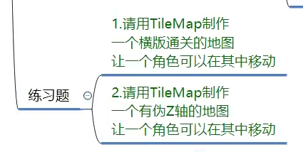

瓦片也有专门的碰撞器

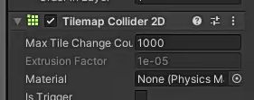

练习题一：

用刚体的速度移动，向上加力跳跃，设置单独没有碰撞器的瓦片资源添加平台效应器

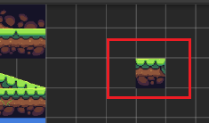

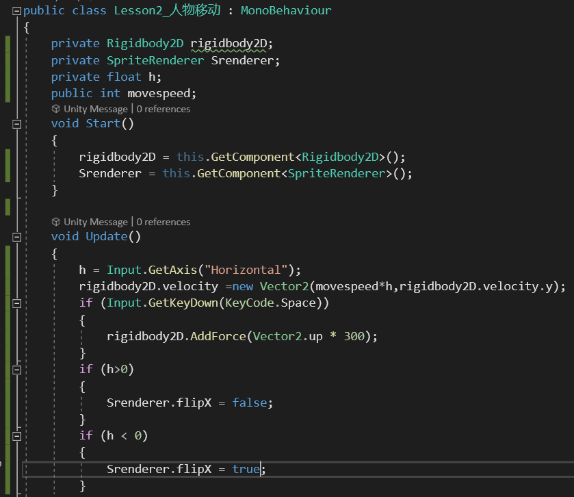

作业2：

什么是伪z轴？

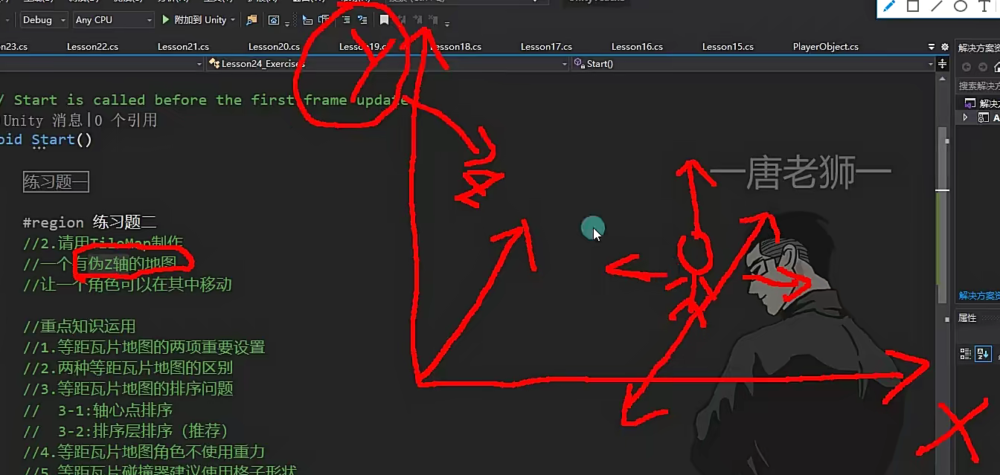

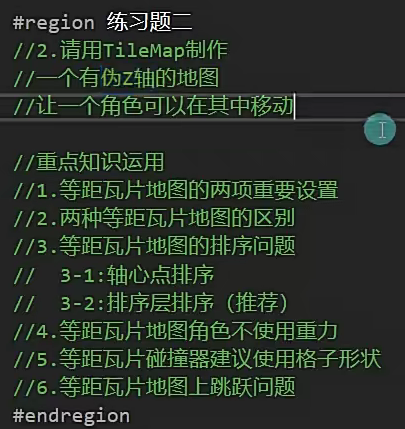

传统的等距瓦片和Z As Y有什么区别？

前者开启笔刷功能不能通过-+改变高度

%!(EXTRA markdown.ResourceType=, string=, string=)

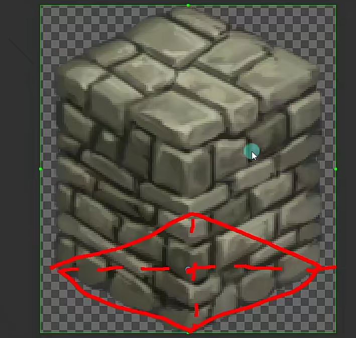

排序有问题，如何解决？

Sprite Renderer有个排序使用的点是什么，默认中心，要调整成轴心点

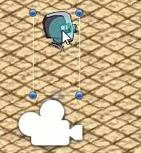

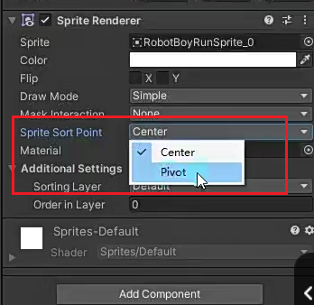

还有一个排序规则：

两个轴心点排序有问题，大于在前面

所以将底下图片轴心点放到最上面，但是会产生偏移（不建议使用）

直接改变层级进行使用，将人物放到比地面低，但是比围墙低的层级，利用TileMap

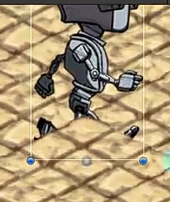

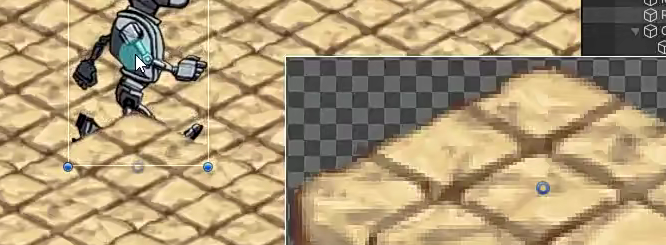

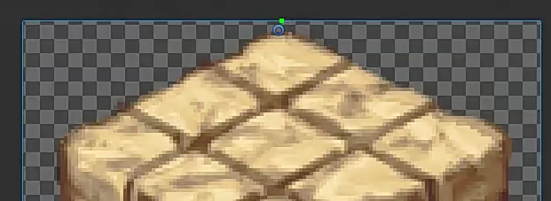

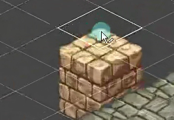

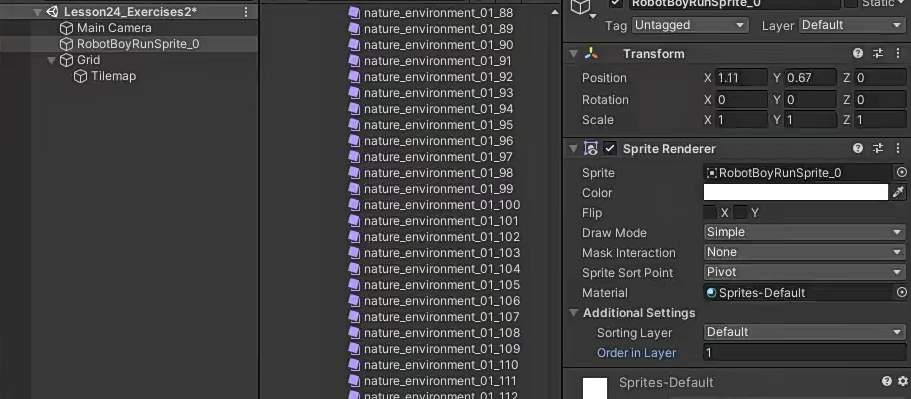

如果这时候加草，这种问题怎么解决？

正常

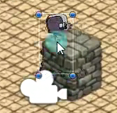

不正常

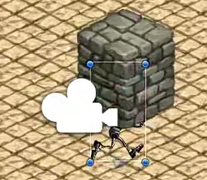

1.利用同层不同轴心点进行排序，人物和草在同一层（方便编辑，但是一个菱形只能放一个树）

2.直接拖一个2D对象，将排序对象设置成轴心点，在底部中心（好处可以挨着很近，但是不好编辑很多）

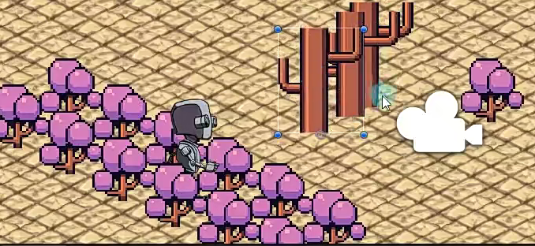

菱形瓦片如何设置碰撞器？

地面不需要产生碰撞，只有围墙才需要碰撞，且围墙的碰撞类型是Grid

但是因为碰撞器的原因走不到最外层，所以最内层不加，只在最外层加

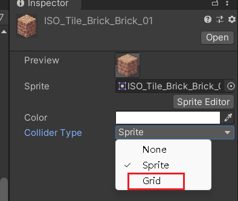

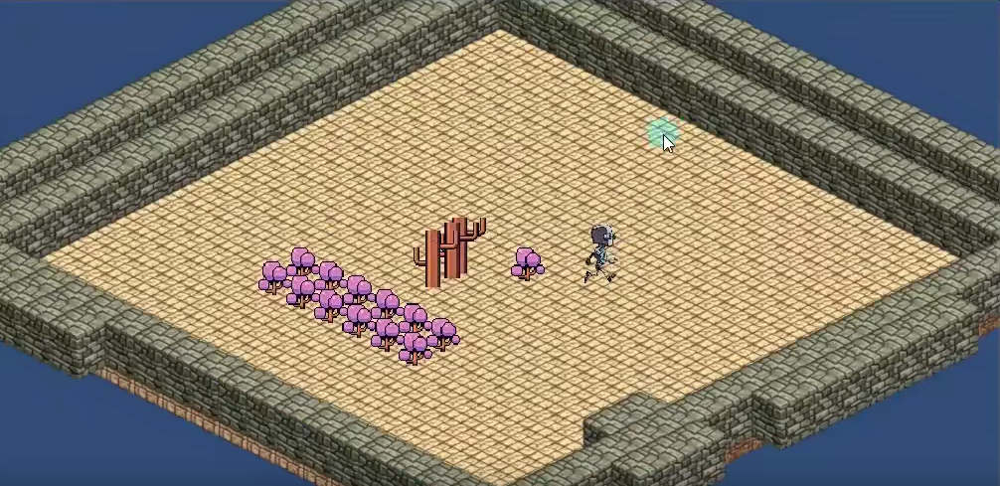

如何做跳跃？

创建空物体做根物体，移动脚本挂载到父物体，跳跃用来调整子物体的y轴来实现。

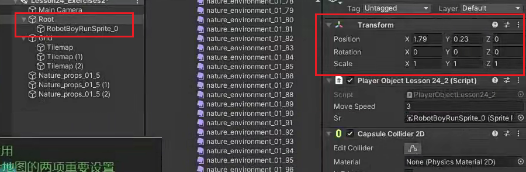
