是什么？
	用于切换多语言时文本、图片的动态替换插件

### 怎么安装和建表？

1. 创建一个本地化设置，并添加对语言环境，Add Locale

   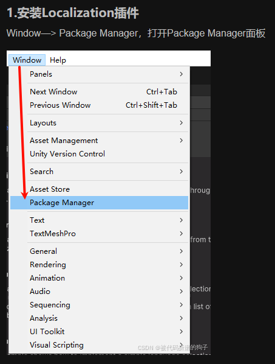 

2. 本地表创建与配置

   1. 文字映射和资源表的映射

      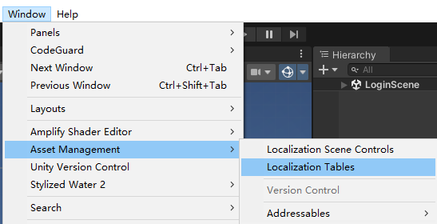 

      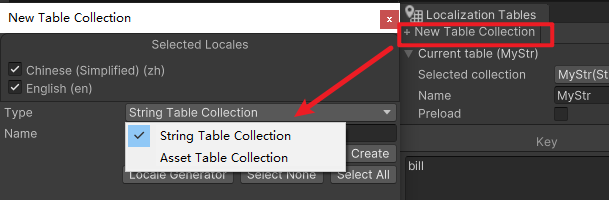 

3. 导入导出CSV表格，可以直接在Excel进行文字映射

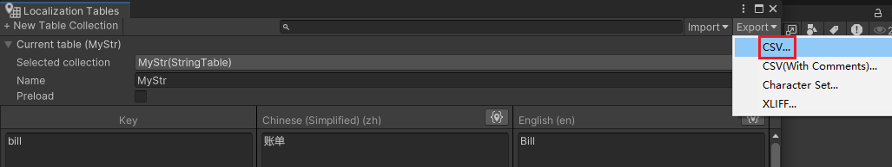 

 

---

### 怎么使用？

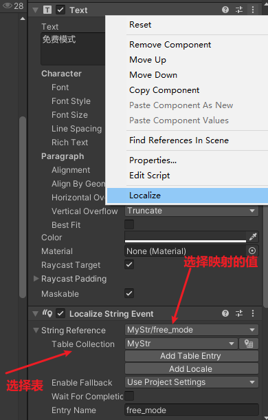 

资源映射同理

#### 初始化怎么设置？

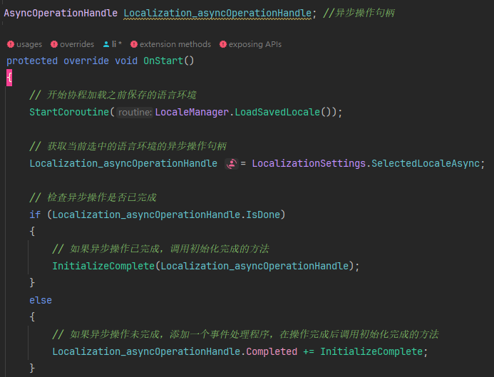 

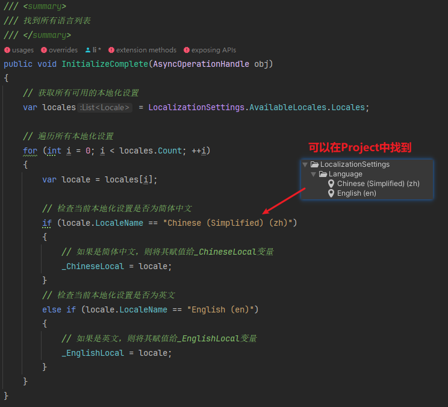 

---

#### 能切换的文字怎么做映射？

 

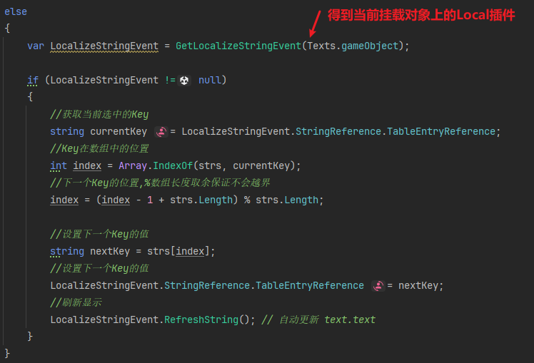 

直接代码切换String Reference就可以了，切换了对应的值，会根据当前中英文进行自动切换映射

---

#### 怎么动态插值？

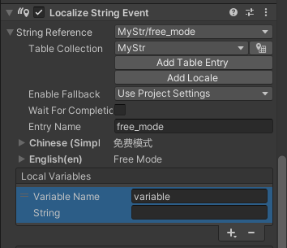 

---

#### 怎么把切换语言呢？

__ChineseLocal和_ _EnglishLocal在初始化时就赋值了

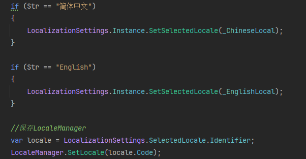 

---

#### 保存配置和提取配置

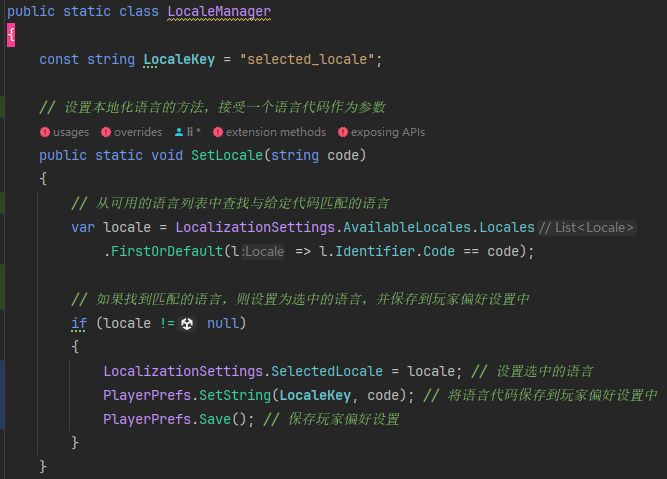 

 
